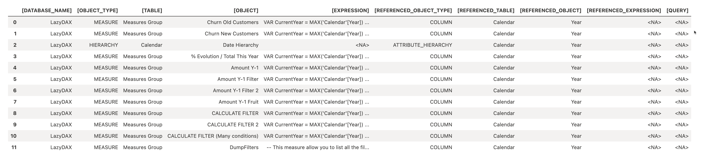
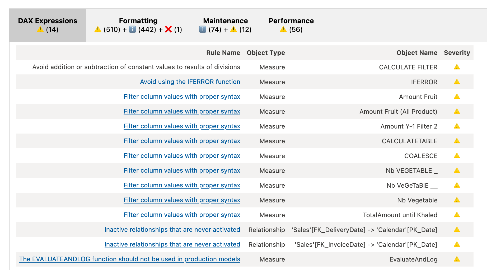
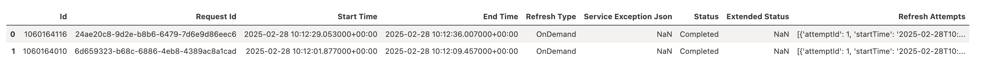

# {{ page.title }}
{: .fs-9 }


{:refdef: style="text-align: center;"}
  
{: refdef .image50 }


{:toc}

{: .note-title :}
>What?
>
>Microsoft Fabric provides a powerful way to interact with **Power BI Semantic Models** using Python, enabling data professionals to explore, analyze, and visualize model metadata efficiently. Whether you need to list tables, retrieve measures, execute SQL/DAX queries, or inspect dependencies, Python and the **Semantic Link** extension make it seamless.  
>
>In this post, I’ll walk you through various operations on a **Power BI Semantic Model** within Microsoft Fabric, covering essential tasks such as querying metadata, visualizing relationships, and tracking dataset refreshes.

## **Why Work with Power BI Semantic Models in Python?**  

Using Python with **Microsoft Fabric** and **Semantic Link** provides several advantages:  
- **Enhanced Model Exploration** – Retrieve metadata about tables, measures, relationships, and dependencies.  
- **Efficient Data Queries** – Execute **SQL and DAX queries** directly within a notebook.  
- **Model Dependency Analysis** – Understand how columns, measures, and expressions interconnect.  
- **Automated Insights & Reporting** – Leverage Python to automate model inspection and streamline reporting.  

## **What This Post Covers**  

This article will explore various **Python-based operations** on a Power BI Semantic Model, including:  
- **Listing tables and measures** in the semantic model.  
- **Executing SQL and DAX queries** to retrieve aggregated insights.  
- **Visualizing model relationships** to understand dependencies.  
- **Analyzing column impact** to track measure and hierarchy usage.  
- **Extracting M code expressions** for reviewing data transformations.  
- **Checking dataset refresh status** to monitor data updates.  

With these capabilities, you’ll be able to **better explore and manage Power BI Semantic Models** within **Microsoft Fabric**, unlocking deeper insights into your data.

---

For this example, I used a Power BI file that already contains data, making it easy to use for testing.  
You can download it here: [LazyDAX.pbix](https://github.com/arnaudgastelblum/LazyDAX/raw/master/LazyDAX.pbix).  

You can also view or download the complete notebook from my GitHub repository:  
[Notebook_SemanticLink.ipynb](https://github.com/arnaudgastelblum/LazySnail/blob/master/Notebook_SemanticLink.ipynb).

---

## Setup: Installing and Importing Required Libraries
```python
%pip install semantic-link
%load_ext sempy

import sempy.fabric as fabric
```


## Exploring Power BI Semantic Models with Python in Microsoft Fabric

### List tables from a Power BI Semantic Model

The `list_tables()` function in the Semantic Link extension retrieves the list of available tables in a Microsoft Fabric semantic model. It helps explore the model by displaying the names of accessible tables.

[https://learn.microsoft.com/en-us/python/api/semantic-link-sempy/sempy.fabric?view=semantic-link-python#sempy-fabric-list-tables](https://learn.microsoft.com/en-us/python/api/semantic-link-sempy/sempy.fabric?view=semantic-link-python#sempy-fabric-list-tables)

```python
fabric.list_tables("LazyDAX")
````


### List Measures from a Power BI Semantic Model

The `list_measures()` function retrieves all measures from a dataset in a Microsoft Fabric semantic model. It provides an overview of the available calculated metrics.

[https://learn.microsoft.com/en-us/python/api/semantic-link-sempy/sempy.fabric?view=semantic-link-python#sempy-fabric-list-measures](https://learn.microsoft.com/en-us/python/api/semantic-link-sempy/sempy.fabric?view=semantic-link-python#sempy-fabric-list-measures)

```python
fabric.list_measures("LazyDAX")
```


## Querying DAX  
This section demonstrates how to run a DAX query in a Python notebook within Microsoft Fabric using the Semantic Link (`sempy`) extension.


### Execute a DAX Query  

The `%%dax` cell magic runs a DAX query directly within the notebook.  
"LazyDAX" refers to the semantic model being queried.

```python
%%dax "LazyDAX"
EVALUATE
SUMMARIZECOLUMNS(
    'Customer'[Country],
    "test", SUM(Sales[TotalAmount])
)
```


## Querying a Power BI Semantic Model with SQL  

This section demonstrates how to use SQL queries to retrieve data from a Power BI Semantic Model in Microsoft Fabric.

### Configure Spark to Access the Semantic Model  

The following command configures Spark to use the Power BI Spark native connector for Spark SQL.

[https://learn.microsoft.com/en-us/fabric/data-science/semantic-link-power-bi?tabs=sql](https://learn.microsoft.com/en-us/fabric/data-science/semantic-link-power-bi?tabs=sql)

```python
spark.conf.set("spark.sql.catalog.pbi", "com.microsoft.azure.synapse.ml.powerbi.PowerBICatalog")
```

### Retrieve Data from a Table  

The `%sql` cell magic allows executing SQL queries within the notebook.  
This query retrieves all columns from the `Customer` table inside the `LazyDAX` semantic model.

```sql
%%sql
SELECT * 
FROM pbi.`LazyDAX`.Customer
```


### Aggregating Data with SQL  

This query achieves the same result as the previous DAX expression, but using SQL on the same Power BI Semantic Model.  
Here, we not only aggregate data but also join tables to combine relevant information:

```sql
%%sql
SELECT 
    Customer.Country,
    SUM(Sales.TotalAmount)
FROM pbi.`LazyDAX`.Sales
INNER JOIN pbi.`LazyDAX`.Customer 
    ON Customer.PK_Customer = Sales.FK_Customer
GROUP BY Customer.Country
```


# Visualizing the Data Model  

This section demonstrates how to extract and visualize relationships within a Power BI Semantic Model using the Semantic Link extension in Microsoft Fabric.

```python
import sempy.fabric as fabric
import pyspark.sql.functions as F

from sempy.relationships import plot_relationship_metadata
from sempy.relationships import find_relationships

relationships = fabric.list_relationships("LazyDAX")
plot_relationship_metadata(relationships)
```


# DAX Semantic Model Information  

## Exploring Active Relationships in a Power BI Semantic Model  

This section demonstrates how to retrieve active relationships from a Power BI Semantic Model using a DAX query.

```sql
%%dax "LazyDAX"
SELECT * 
FROM $System.DISCOVER_CALC_DEPENDENCY 
WHERE OBJECT_TYPE = 'ACTIVE_RELATIONSHIP'
```


## Column Impact: Who Uses This Column?  

This section demonstrates how to analyze the impact of a specific column in a Power BI Semantic Model using a DAX query.

```sql
%%dax "LazyDAX"
EVALUATE
FILTER(
    INFO.CALCDEPENDENCY(),
    [REFERENCED_TABLE] = "Calendar"
    && [REFERENCED_OBJECT] = "Year"
)
```




# Fabric / Power BI Capacities  

[https://learn.microsoft.com/en-us/python/api/semantic-link-sempy/sempy.fabric?view=semantic-link-python#sempy-fabric-list-capacities](https://learn.microsoft.com/en-us/python/api/semantic-link-sempy/sempy.fabric?view=semantic-link-python#sempy-fabric-list-capacities)

```python
fabric.list_capacities()
```


## Exploring M Code in a Power BI Semantic Model  

This section demonstrates how to list and inspect M (Power Query) expressions used in a Power BI Semantic Model within Microsoft Fabric.

```python
fabric.list_expressions(dataset="LazyDAX")
```


## List All Existing Workspaces  

[https://learn.microsoft.com/en-us/python/api/semantic-link-sempy/sempy.fabric?view=semantic-link-python#sempy-fabric-list-workspaces](https://learn.microsoft.com/en-us/python/api/semantic-link-sempy/sempy.fabric?view=semantic-link-python#sempy-fabric-list-workspaces)

```python
fabric.list_workspaces()
```

# Listing Semantic Models from a Remote Workspace  

This section demonstrates how to list all semantic models available in a specific Power BI workspace using Microsoft Fabric.

[https://learn.microsoft.com/en-us/python/api/semantic-link-sempy/sempy.fabric?view=semantic-link-python#sempy-fabric-list-datasets](https://learn.microsoft.com/en-us/python/api/semantic-link-sempy/sempy.fabric?view=semantic-link-python#sempy-fabric-list-datasets)

```python
fabric.list_datasets(workspace="YourWorkspace")
```

# Tabular - BPA - Best Practice Analyzer  

```python
fabric.run_model_bpa(dataset="LazyDAX")
```



## Checking Refresh Status of a Semantic Model  

This section demonstrates how to retrieve refresh information for a Power BI Semantic Model in Microsoft Fabric.

```python
import sempy.fabric as fabric

fabric.list_refresh_requests(dataset="LazyDAX")
```



