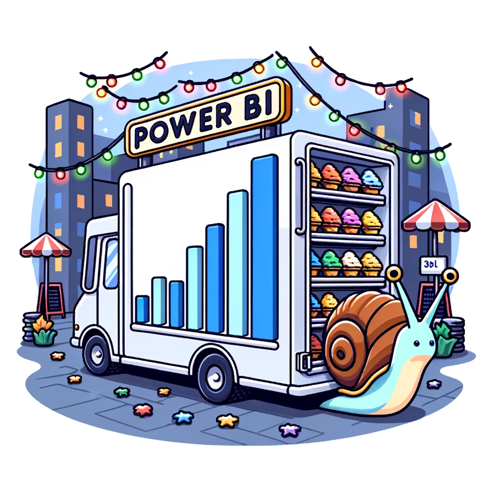

# Power BI

{: .image60 }

  <h2 style="font-size: 1.6em; color: #2c3e50; margin-bottom: 15px;">📊 Latest Articles on Power BI</h2>
    
    
      
          <a href="{{ post.url }}" style="font-size: 1em; color: #3498db; text-decoration: none; transition: color 0.3s ease;">
            {{ post.title }}
          </a>
           - {{ post.date | date: "%d/%m/%Y" }}
          

 <!-- Custom small space -->
      
    

