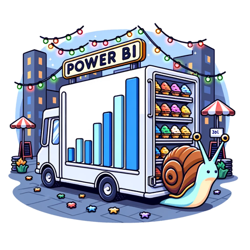

# Power BI

{: .image50 }

## All Articles
{: .section-title }

<ul class="article-list">
  
  
    
      <li class="article-item">
        <a href="{{ post.url }}">{{ post.title }}</a>
        {{ post.date | date: "%d %b %Y" }}
      </li>
    
  
</ul>
