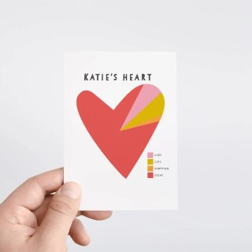
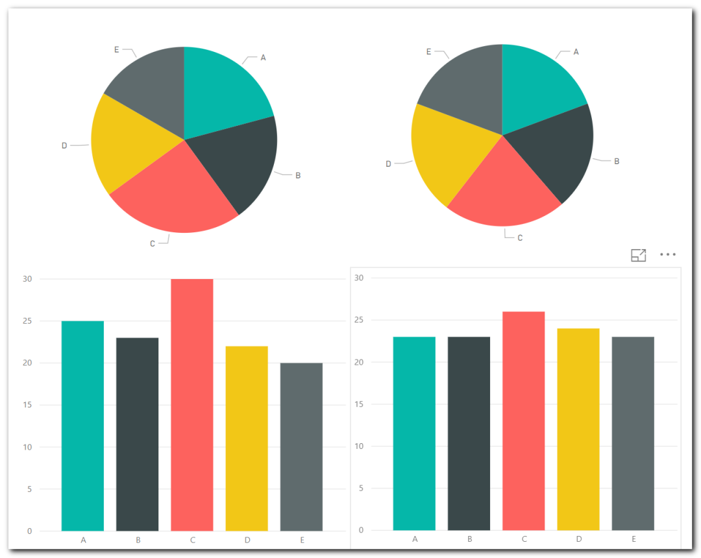

# {{ page.title }}
{: .fs-9 }

{:toc}

{: .note :}
>Why the Pie Chart is not recommended in data visualization, and why comparing angles is harder than comparing lengths.

During my presentation at Power Saturday in Paris, I wanted to demonstrate to an already very optimistic public that Power BI is a great tool and that modeling is a must-have for their reports. (Data Modelling is not the subject here)
Power BI a super tool? Yes, and to complete this idea, I added some slides to highlight each piece of the tool.

**One of the slides showed the ease and elegance of the visuals.** After a quick search on Google images, I copied a screenshot created by a user in Power BI and added it to my presentation.

In the audience, two friends looked at me with a horrible face. **The damage was done, I had slipped the image of a Pie Chart!**

Nothing crazy, isn't it? But when you know a bit of the history of the Pie Chart, we realize that this visual component is not recommended in the world of Data Viz. This blog post also follows some more or less tense discussions between colleagues.

{: .note-title :}
>I wrote this article for many reasons:
>
>This point is already super documented on internet but some people never read them before. (I provide links at the end)
>I wanted to convinced myself first, and created a Power BI file to confirm this point. (CFR the following screenshot)

## I was a Pie Chart lover

I know that its use is not recommended and I try not to use it.
But yes, I liked it!
- It's beautiful!
- It's colorful!
- **It gives a professional look to our reports!**
- It shows information!
- **It gives me some pride to not use tables or matrix. (Yes, I like numbers, not you?)**

I think we are used to seeing this kind of visualization since our earliest childhood in commercial brochures, professional documents.

The Pie Chart is visual, and help us to return information quickly. **But unfortunately, this information is not always the right one.**

## Why?

To compare groups, we evaluate the difference of the **amplitude of the angles** while a histogram will request us to **compare lengths** between them.

A long description is not needed, I would prefer to show you 2 set of data, both represented in a Pie Chart and histogram.

**Your first look** will give you some information, but not as much precise compared to the two histograms below. It's possible to have quick information, but very hard to have a clear interpretation of them.

**If I didn't convince you, try to sort each portion from the smallest to the biggest. Try to do the same with the histogram and compare the time elapsed for both.**

## More info

[https://www.data-to-viz.com/caveat/pie.html](https://www.data-to-viz.com/caveat/pie.html)

[https://medium.com/@clmentviguier/the-hate-of-pie-charts-harms-good-data-visualization-cc7cfed243b6](https://medium.com/@clmentviguier/the-hate-of-pie-charts-harms-good-data-visualization-cc7cfed243b6)
