# {{ page.title }}
{: .fs-9 }

{:refdef: style="text-align: center;"}
  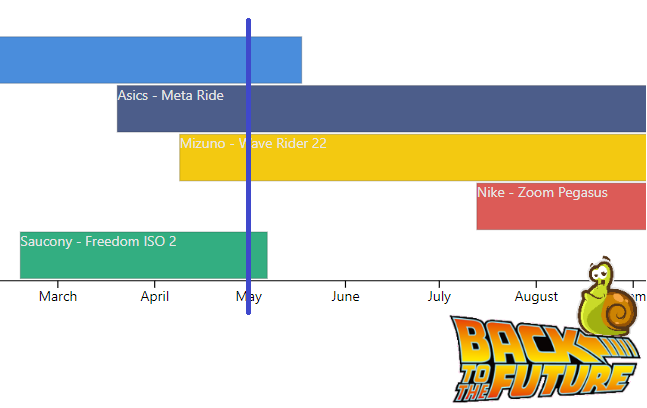
{: refdef}

# Introduction

We often have descriptive data in our Power BI models. Data may vary over time and have validity dates. It can become a real headache when creating a data model.

**What kind of data ?**
- A **car** could change his **production plant** through time.
- A **car** can have different **engines over time.
- A customer can have **through time**:
  - One or more **loyalty cards**
  - One or more **addresses**

**What data types ?**
- Multiple data
- With a **notion of time**. (The information is valid from one date to another and potentially followed or overlapped by another)


{: .note-title :}
>PIT - Point In Time - Datavault
>
>Point In Time is a concept widely used when creating a data warehouse in a Datavault flavor. Performing a snapshot and historizing the data makes restitution much easier.
>(I will not discuss the pros or cons of Datavault, but I have my preferences ^^)
>If you want to know more, I invite you to read this article. (Written by Dan Linstedt)


## What do we expect?
It is exciting for our users to navigate through the data by applying a time filter (CFR Slicer Date)
**How**: By creating a DAX measure. (#PIT Shoes)

The following example shows dynamically Pauline's shoes over the time.
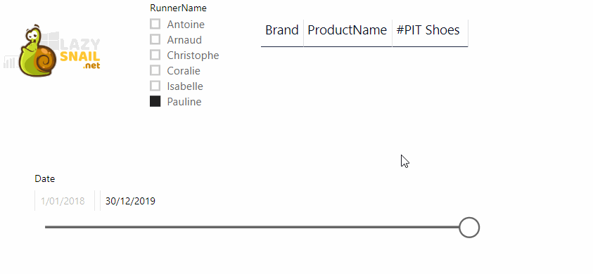


## DataModel

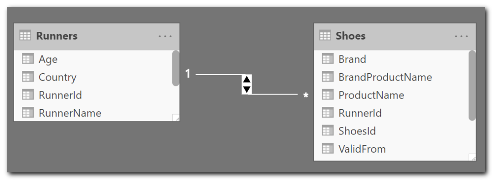

## Our data model
The following example is quite simple (<em>**The Power BI file is available for download at the end of this article**</em>)
Many of you know it, I am passionate about Power BI, running, but many ignore my "passion" with running shoes. (Nobody is perfect !)
**The example refers to a list of runners who have one or more pairs of shoes over time.**


## The **Runners** table:
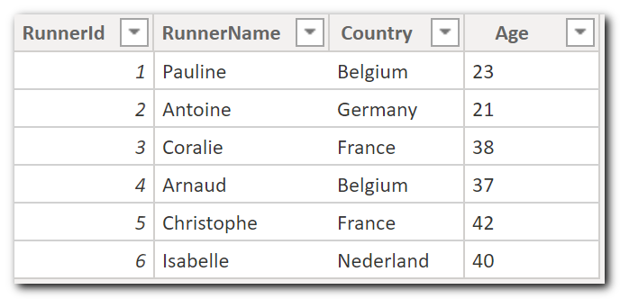

## The **<g class="gr_ gr_7 gr-alert gr_gramm gr_inline_cards gr_run_anim Grammar multiReplace" id="7" data-gr-id="7">Shoes</g>** table**<br />**
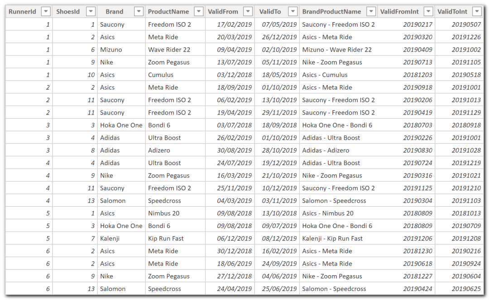


## Model specificities

- **RunnerId** (The Runner Table Key) is available for all shoes.
- For performance reasons, the date stamps are duplicated and converted into **numeric**.
  - ValidFrom - **ValidFromInt**
  - ValidTo - **ValidToInt**


{: .note-title :}
>More information
>
>This is denormalization of a star schema generally composed of a **Bridge** and a **dimension** table.
>In a Datawarehouse (Kimball), we should have a Bridge: `BridgeRunnerShoes` and a dimension: `DimShoes`
>
>**Why**
>
>It helps our users to have better **comprehension**. (Simplicity)<br />The Vertipaq engine will **compress** the redundant information<br />To avoids an extra <g class="gr_ gr_19 gr-alert gr_gramm gr_inline_cards gr_run_anim Style >multiReplace" id="19" data-gr-id="19">join / relationship</g>.
>You want to know more about Bridges:
>[https://www.kimballgroup.com/data-warehouse-business-intelligence-resources/kimball-techniques/dimensional-modeling-techniques/multivalued-dimension-bridge-table/](https://www.kimballgroup.com/data-warehouse-business-intelligence-resources/kimball-techniques/dimensional-modeling-techniques/multivalued-dimension-bridge-table/)


## A more complete model could look like this one
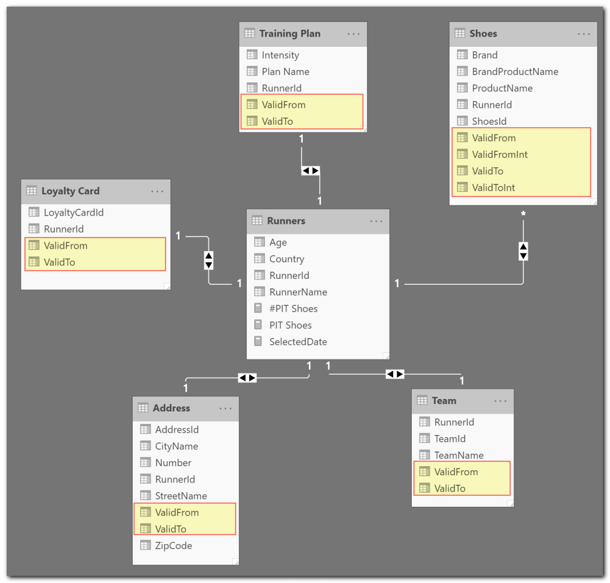


## TimeLine


### Graphically analyze the different interactions.

- Our user pick a date via the **PIT Date slicer**
- The shoe table changes dynamically and <g class="gr_ gr_12 gr-alert gr_gramm gr_inline_cards gr_run_anim Grammar multiReplace" id="12" data-gr-id="12">display</g> the one owned on that date.

**NB The blue bar drawn on the timeline has been added manually in MS Paint. (If you know a visual component that can display it, do not hesitate to contact me)**


### Filter: 01/02/2019 | Pauline
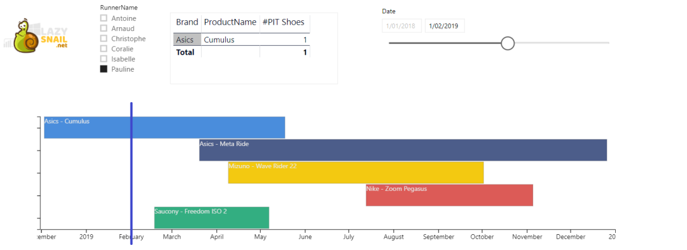


### Filter: 01/03/2019 | Pauline
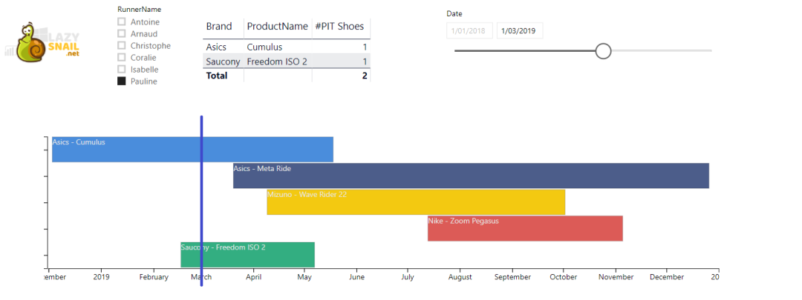


### Filter: 01/05/2019 | Pauline
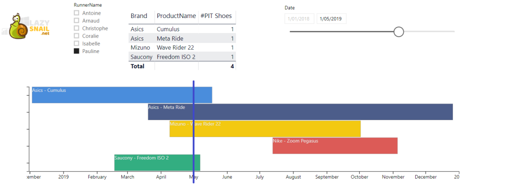


### Filter: 10/10/2019 | Pauline
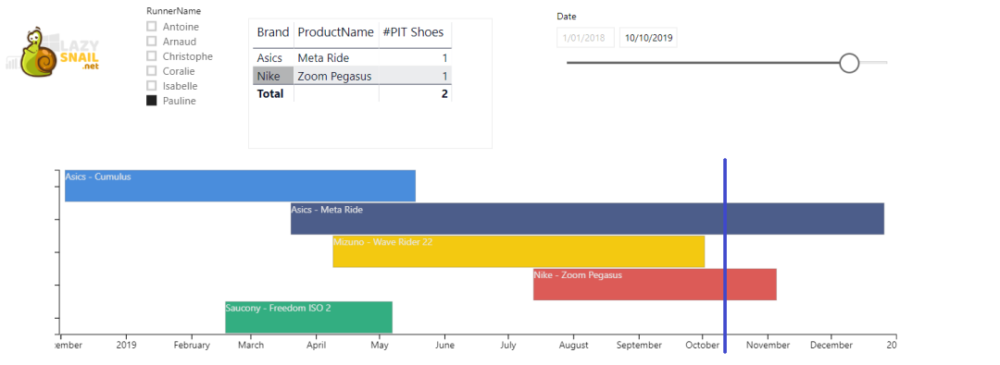


### Filter: 01/12/2019 | Pauline


## Implementation


### Create a Calendar table

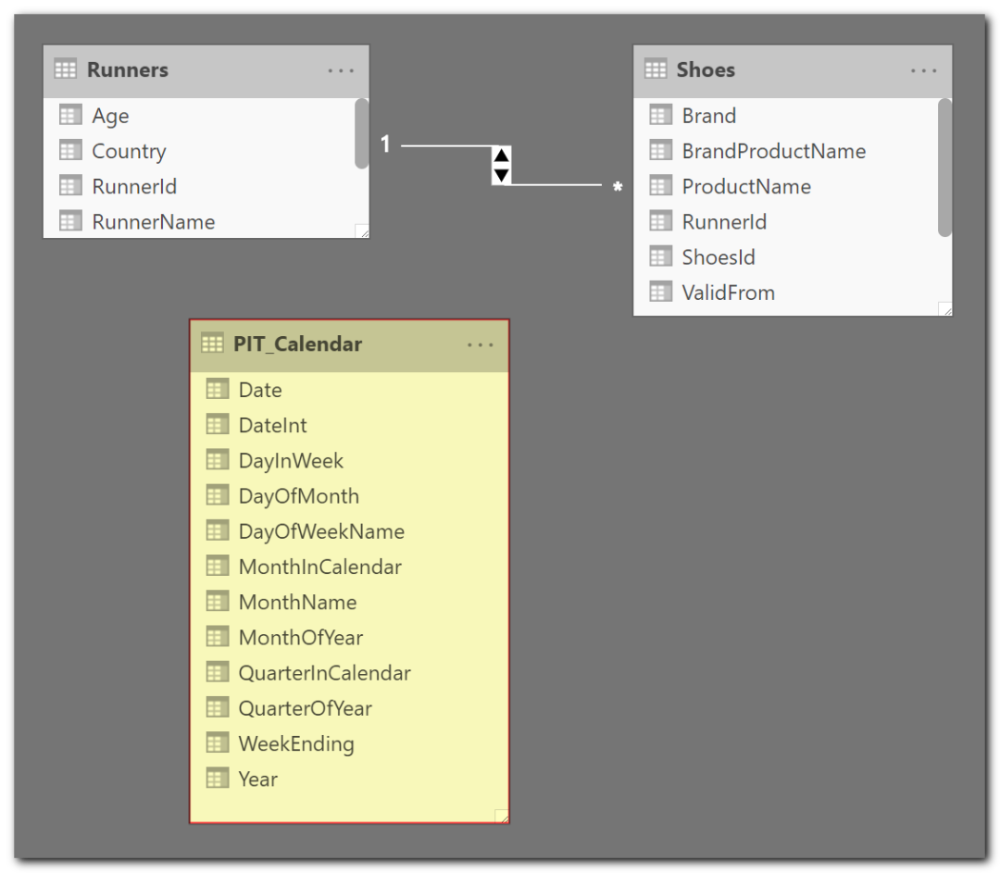

We have to create a Date table, which will **not be associated with our model**. (Called here **PIT Calendar**)
To quickly create a Calendar table, I suggest you write an M Query in the Query Builder. The following articles will give you the approach.
[https://blog.crossjoin.co.uk/2013/11/19/generating-a-date-dimension-table-in-power-query/](https://blog.crossjoin.co.uk/2013/11/19/generating-a-date-dimension-table-in-power-query/)
[https://www.mattmasson.com/2014/02/creating-a-date-dimension-with-a-power-query-script/](https://www.mattmasson.com/2014/02/creating-a-date-dimension-with-a-power-query-script/)


### Create a DAX Measure

This measure Filter the **Shoes** table by the selected date.

```
#PIT Shoes =
  VAR CurrentDateInt = MAX(PIT_Calendar[DateInt])
  RETURN
  CALCULATE
  (
    DISTINCTCOUNT(Shoes[ShoesId]);
    FILTER(
      'Shoes';
      Shoes[ValidFromInt] <= CurrentDateInt && Shoes[ValidToInt]>= CurrentDateInt
    )
    ; 'Runners'
  )
```


### Understand this DAX expression

```
VAR CurrentDateInt =
  IF(
    ISCROSSFILTERED(PIT_Calendar)
    ;MAX(PIT_Calendar[DateInt])
    ;VALUE(YEAR(TODAY())*10000 + MONTH(TODAY())*100 + DAY(TODAY()))
  )
```
**Why?**
- The user wants to have the **situation of the day** (without having to modify the PIT slicer at each opening of the report)
- The user **forgot** to create his report with the PIT slicer. Rather than propose the situation in the future, we apply the current one.

```
FILTER(
  'Shoes';
  Shoes[ValidFromInt] <= CurrentDateInt && Shoes[ValidToInt] >= CurrentDateInt
)
```

## Conclusion

Now, you know how to make your data alive.
Feel free to comment if you have more ideas, improvements, tips, or comments.
[Download the Power BI example file here](https://github.com/arnaudgastelblum/LazySnail/raw/master/LazySnail_PointInTime.pbix)

**Edit 02/12/2021**: If you want to know more or enjoy another point of view Reza Rad did a nice article on this topic too:
[Power BI From and To Date Filtering with One Slicer - RADACAD](https://radacad.com/power-bi-from-and-to-date-filtering-with-one-slicer)

