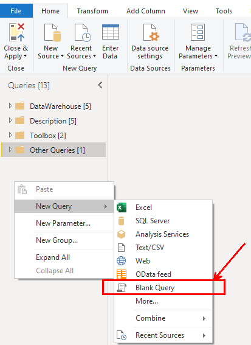
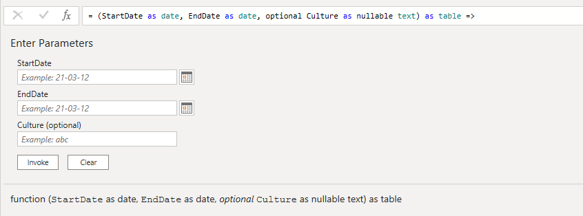
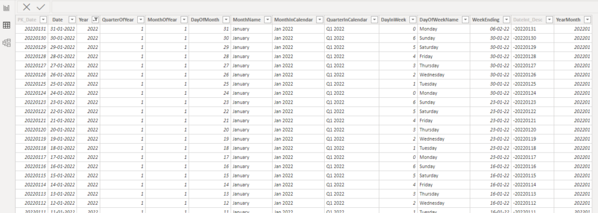
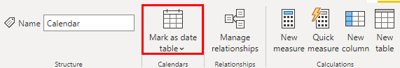

# {{ page.title }}
{: .fs-9 }

{: .image40 }

## Calendar Dimension

In our Power BI datasets, the best way to deals with dates and DAX intelligence functions is to use a Calendar Table.
This table should be link to your Fact table.
Good news, this table can be created in 2 clicks with Power Query (Transform Data) in Power BI!

## How to create the table

Go to `transform data` and right click on `Queries` to create a new Blank Query

{: .image50 }

Now Copy the following code and paste it to the blank query create.


let CreateDateTable = (StartDate as date, EndDate as date, optional Culture as nullable text) as table =>
  let
    DayCount = Duration.Days(Duration.From(EndDate - StartDate)),
    Source = List.Dates(StartDate,DayCount,#duration(1,0,0,0)),
    TableFromList = Table.FromList(Source, Splitter.SplitByNothing()),
    ChangedType = Table.TransformColumnTypes(TableFromList,{{"Column1", type date}}),
    RenamedColumns = Table.RenameColumns(ChangedType,{{"Column1", "Date"}}),
    InsertYear = Table.AddColumn(RenamedColumns, "Year", each Date.Year([Date])),
    InsertQuarter = Table.AddColumn(InsertYear, "QuarterOfYear", each Date.QuarterOfYear([Date])),
    InsertMonth = Table.AddColumn(InsertQuarter, "MonthOfYear", each Date.Month([Date])),
    InsertDay = Table.AddColumn(InsertMonth, "DayOfMonth", each Date.Day([Date])),
    InsertDayInt = Table.AddColumn(InsertDay, "DateInt", each [Year] * 10000 + [MonthOfYear] * 100 + [DayOfMonth]),
    InsertMonthName = Table.AddColumn(InsertDayInt, "MonthName", each Date.ToText([Date], "MMMM", Culture), type text),
    InsertCalendarMonth = Table.AddColumn(InsertMonthName, "MonthInCalendar", each (try(Text.Range([MonthName],0,3)) otherwise [MonthName]) & " " & Number.ToText([Year])),
    InsertCalendarQtr = Table.AddColumn(InsertCalendarMonth, "QuarterInCalendar", each "Q" & Number.ToText([QuarterOfYear]) & " " & Number.ToText([Year])),
    InsertDayWeek = Table.AddColumn(InsertCalendarQtr, "DayInWeek", each Date.DayOfWeek([Date])),
    InsertDayName = Table.AddColumn(InsertDayWeek, "DayOfWeekName", each Date.ToText([Date], "dddd", Culture), type text),
    InsertWeekEnding = Table.AddColumn(InsertDayName, "WeekEnding", each Date.EndOfWeek([Date]), type date)
  in
    InsertWeekEnding
in
  CreateDateTable


## Run the function

{: .image90 }

Choose a `StartDate` and an `EndDate`, click Invoke

{: .image90 }

That's it! You have a beautiful calendar table.

{: .image90 }

Do not forget to mark this table as a data table

{: .note :}
> Credit: I found this code on internet many years ago and used it in the LazyDAX file. 
> I changed it, but I can't redirect and credit the one who created it. 
> I think it can help you a lot, that's why I'm sharing it with you :)
