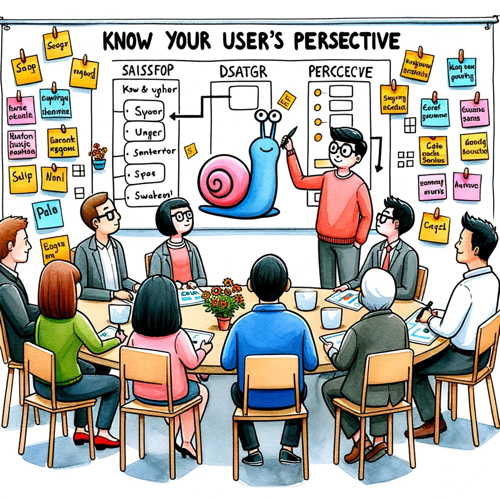
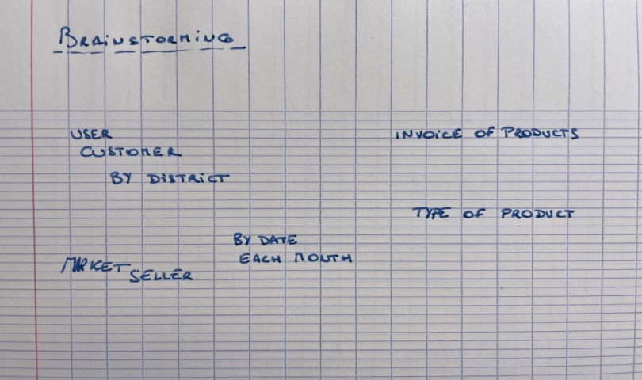
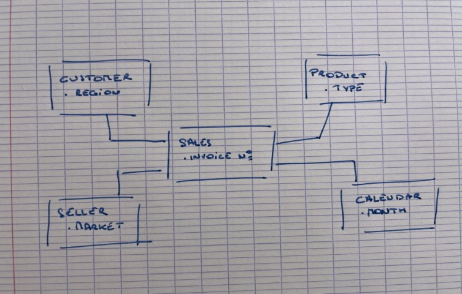

# {{ page.title }}
{: .fs-9 }

{: .image50 }

As we approach year's end, I wanted to share a special gift with you! It's a topic that I often emphasize with my team and makes up 80% of a successful Power BI journey.

## Technology Takes Center Stage

Most developers, and yes, I'm referring to you, invest significant time diving deep into their data sources, the transformation processes, and the intriguing dynamics of their DAX measures. And rightly so!

## Why this piece?

After spending days, weeks, or even months, we often find ourselves proud of our datasets – not just the reports, but the underlying datasets that can power numerous reports. Although our model may contain ample data, the pressing question is, how user-friendly is it? Whether it's for an external user, a peer, or even your children, the usability can vary.

There are inherent complexities, such as:
- Excessive tables
- A myriad of relationships and the challenge in deciphering interactions between tables.
- A model that retains the intricacy of its source systems.

Yes, we've put in hard work to craft this model, and it functions seamlessly! A user might need a couple of hours to grasp its nuances, but is that efficient? Think about it: I adore cars, yet lack technical knowledge. Should I understand engine mechanics to drive? It's a bonus, but not a prerequisite.

## My proposal?

With little effort, you can maintain clarity about your objectives, chiefly to deliver an exceptional dataset. I suggest sketching your model on paper before starting. You should be familiar with the data's presentation and how users categorize it. If unclear, now's the time to engage users and jot down key terminologies.

Engage with users before projects to understand their roles and tools better. This helps gain insights into their thought processes, requirements, and current gaps. I typically scribble down essential terms at this stage.

Back at my workspace, I review this sketch and attempt to categorize these terms, giving birth to tables. And since I'm an ardent Kimball admirer, let's dub them Dimensions!

Having these tables means possessing a user-centric view of the data. The exciting challenge lies in molding the data to fit this view, but with tools like Power Query and SQL, it's fairly straightforward, right?

## To sum up

Rather than diving straight into the data, first set clear objectives. Engage with users, liaise with peers, and aim to create the ideal model. Adaptations might occur during development, which is natural. However, sticking to your foundational model ensures a win-win outcome for all.

Cheers to your data adventures! It's indeed a thrilling profession!