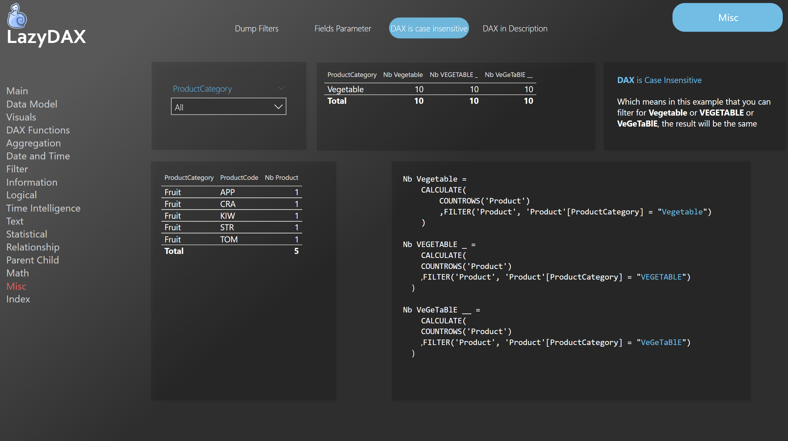

# {{ page.title }}
{: .fs-9 }


This week with my colleague <a href="https://www.linkedin.com/in/vincent-philippot-227bb2139/" data-type="URL" data-id="https://www.linkedin.com/in/vincent-philippot-227bb2139/">Vincent Philipot</a>, we learned something that many of you already know. (But maybe not!)

You can download the [Power BI file on GitHub](https://github.com/arnaudgastelblum/LazyDAX/raw/master/LazyDAX.pbix)


{: .note :}
>DAX is case insensitive!!
>    Yes!! And nobody told me before!


## What does it mean?

Here is a short description available on <a href="https://en.wikipedia.org/wiki/Case_sensitivity" data-type="URL" data-id="https://en.wikipedia.org/wiki/Case_sensitivity">Wikipedia</a>


But because an example is worth a thousand words, here is some screenshot. (<a href="https://lazysnail.net/en/lazydax/" data-type="URL" data-id="https://lazysnail.net/en/lazydax/">You can download this example in the lazydax file</a>)

In our dataset we have 10 differents Products with a **ProductCategory = Vegetable**


---

I wrote 3 differents measures to count the number of product with a ProductCategory equal to:

## Vegetable

```sql
Nb Vegetable = 
    CALCULATE(
        COUNTROWS('Product')
        ,FILTER('Product', 'Product'[ProductCategory] = "Vegetable")
    )
```

## VEGETABLE

```sql
Nb VEGETABLE _ = 
    CALCULATE(
        COUNTROWS('Product')
        ,FILTER('Product', 'Product'[ProductCategory] = "VEGETABLE")
    )
```

## VeGeTaBlE


```sql
Nb VeGeTaBlE __ = 
    CALCULATE(
        COUNTROWS('Product')
        ,FILTER('Product', 'Product'[ProductCategory] = "VeGeTaBlE")
    )
```

---

And when me and most of my colleagues would expect a different behavior, **results are the same**


## Conclusion

I think I didn't see it before because I have a strong programmer background, and it seems very weird to me.<br />And when I have to filter to a subset of value, I only base my <strong>FILTER </strong>on technical codes that have that kind of soft rules already applied.


<a href="https://lazysnail.net/en/lazydax/" data-type="URL" data-id="https://lazysnail.net/en/lazydax/">You can download this example in the lazydax file here</a>




## More articles

After a web search, I saw that our Power BI stars (Data gods in reference to <a href="https://www.kratosbi.com/data-gods" data-type="URL" data-id="https://www.kratosbi.com/data-gods">this list</a> from <a href="https://www.linkedin.com/in/wagnerchris/" data-type="URL" data-id="https://www.linkedin.com/in/wagnerchris/">Christopher Wagner</a>) wrote very nice articles about this subject.

<a href="https://www.sqlbi.com/articles/letter-case-sensitivity-in-dax-power-bi-and-analysis-services/">Letter case-sensitivity in DAX, Power BI and Analysis Services - SQLBI</a>

<a href="https://blog.crossjoin.co.uk/2019/10/06/power-bi-and-case-sensitivity/">Chris Webb's BI Blog: Power BI And Case Sensitivity Chris Webb's BI Blog (crossjoin.co.uk)</a>


In all the cases, I hope that you learned something new! :)
