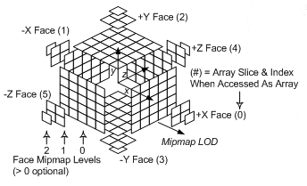
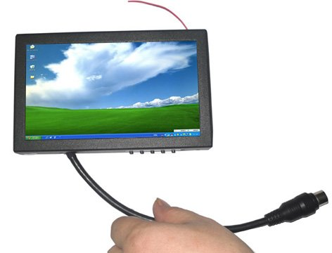

# {{ page.title }}
{: .fs-9 }

{:toc}

{: .note :}
>A simple but powerful debugging technique for Power BI: duplicate your report pages, strip away the noise, and isolate the problem to understand your measures and filter context.

{: .image60 }

This article seems obvious, but that's something that I do a lot, and this is the first thing I do when somebody asks me a question.

After many weeks, some clients tell me: "Now, **I'm using your technique too"**

But I don't feel to own this! It's pretty simple, but in fact, if you didn't use it before, it can help you a lot!

So, yes, I'm duplicating my page!

*A lot!!!!*

## A focus version

When I have an issue or a question, **the first thing I do** (after crying), **it's duplicate the page**.

On this page, I remove everything not useful to test

- Visuals
- Images

I transform all the visuals I want to test (hopefully only one) into a table.

Let's call it the "**focus version**"

## Test your filter context

When I have a cleaner version of my report I can **duplicate it.** (again)

On this new page, I **remove one by one**:

- Filter on slicers
- Filter in the filter pane (Be careful to remove the one hidden)
- Hidden Slicers (Synced slicers)

**Until my values change and I can understand them.**

This step helps me to trust the data and understand the measure. It also helps me to trust the behavior of each filters.

## Test one particular case

You are the best and main debugger of Power BI!

Based on the previous topic, now you are confident with your evaluation context! I would recommend you to filter on a very specific case available in your data.

For example:

- One transaction ID (one row in your sales table)
- One Invoice Id

Many users don't look their data at a very low level, and trust me, that's very important!

If you know the story and behavior of your DAX measure for a very specific case, you can predict how it will work for 2 and many more.

## Split your measures and display their result

In our DAX measure, we can have multiple steps and complexity. That's why the best practice is to use Variables (VAR), and I know that you already use it!

But do you test it? How to do it?

- Duplicate your measure (yes, Duplicate duplicate everywhere) and change the RETURN section by returning the value of one of your variable.

Many month after our work some changes can impact our measure!

- Relation between tables can be different
- Data aren't the same again
- You change the slicer with a different attribute! (Same value, but different attribute, ..)

By testing your old good variables, you can trust and confirm how they work. (Specially if everything is still ok for your evaluation context)

## Conclusion

Most of the time, on a report, crowded with many visuals we aren't able to find the main reason for our "problem".

We keep focus on not useful stuff and we are to scare (or lazy) to have a look deep dive.

In two sentences:

1. **Less is more**
2. **Duplicate your page et destroy everything**

Bonus: Duplicate page and measure is one point! But don't forget to duplicate your .PBIX file.. In case of emergency :)

I wish you all the best and a lot of duplication.
