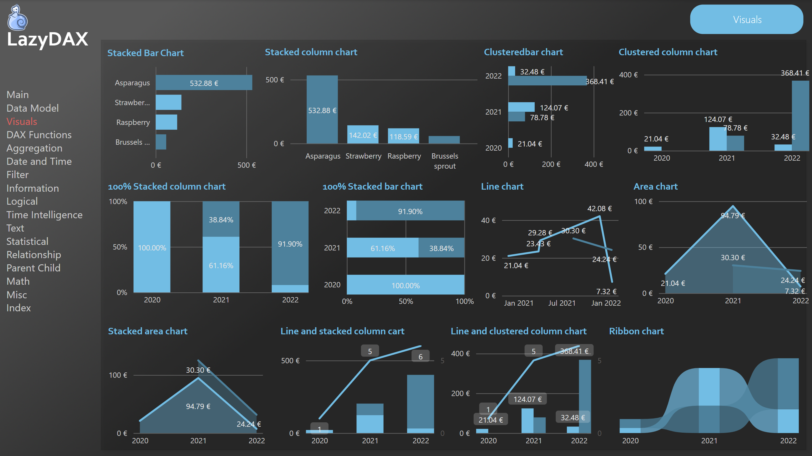
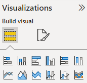

# {{ page.title }}
{: .fs-9 }

# {{page.title}}

You can download the [Power BI file on GitHub](https://github.com/arnaudgastelblum/LazyDAX/raw/master/LazyDAX.pbix)

<h2 id="why-this-list">Why this list?</h2>

<!-- /wp:heading -->

<!-- wp:paragraph -->

Today, I had some time to learn! I think I'm not that bad for <strong>data modeling, T-SQL, SQL server performance, Power Query, DAX, coaching and understanding user requirements</strong>. (Yes, sometimes it's very good to <strong><mark style="background-color:rgba(0, 0, 0, 0)" class="has-inline-color has-vivid-green-cyan-color">be kind to yourself</mark></strong> :) )

<!-- /wp:paragraph -->

<!-- wp:paragraph -->

But putting effort into many different techs skills, I should mention it to the whole world (at least you, because you are reading my blog post).

<!-- /wp:paragraph -->

<!-- wp:pullquote -->

{: .warning :}
>I'm not that good when it's time to pick the best visual to show our data!

## Table and Matrix fan

You will maybe recognize you in my description! I'm the kind of guy who uses Table and Matrix a lot. For testing and understanding my data! Matrix is wonderful! You can look at the behavior of your measures at the different grain in one minute! List, Sub Total, Total!! Amazing!

<h2 id="i-can-t-stop-my-crazy-pleasure-to-click-on-all-that-kind-of-visuals">I can't stop my crazy pleasure to click on all that kind of visuals</h2>

<!-- /wp:heading -->

<!-- wp:image {"align":"center","id":5178,"sizeSlug":"full","linkDestination":"none"} -->

<figure class="aligncenter size-full"></figure>

<!-- /wp:image -->

<!-- wp:paragraph -->

When I'm proud of it, I try to build a visual useful for my users. So I transform this table into a graphic. I click the first button, then I change for the second and I can't stop my crazy pleasure to click on all that kind of visuals!! But do I know what I'm choosing? NO! I knew, yes.. But right now, I'm just clicking to find the best one who will give me the satisfaction between 2 tasty coffees. (And yes, Power BI is also a question of feeling and pleasure. Like a very addictive game)

<!-- /wp:paragraph -->

<!-- wp:paragraph -->

With the image on top, I tested all these graphics and keep a trace of them. First, to help me the next time I need to pick the right one. (And I hope, it can help you too)

## More links

<a href="https://docs.microsoft.com/en-us/power-bi/visuals/power-bi-visualization-types-for-reports-and-q-and-a">Visualization types in Power BI - Power BI | Microsoft Docs</a>

Next step? I still need to learn more about visualization! And I will! And you, do you click everywhere until you have the best one? If no, how did you become data artist / story teller?

