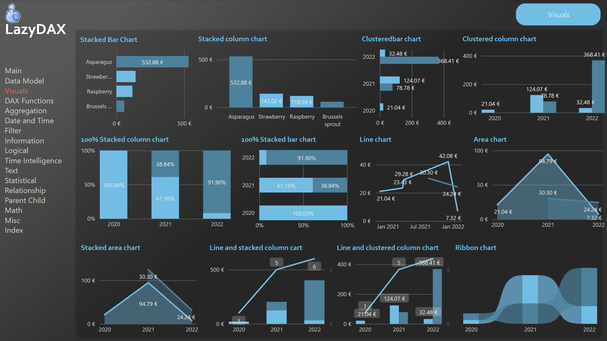
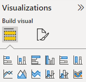

# {{ page.title }}
{: .fs-9 }

{:toc}

{: .note :}
>A visual guide to help you pick the right Power BI chart for your data. You can download the [Power BI file on GitHub](https://github.com/arnaudgastelblum/LazyDAX/raw/master/LazyDAX.pbix).

## Why this list?

Today, I had some time to learn! I think I'm not that bad for **data modeling, T-SQL, SQL server performance, Power Query, DAX, coaching and understanding user requirements**. (Yes, sometimes it's very good to **be kind to yourself** :) )

But putting effort into many different tech skills, I should mention it to the whole world (at least you, because you are reading my blog post).

{: .warning :}
>I'm not that good when it's time to pick the best visual to show our data!

## Table and Matrix fan

You will maybe recognize yourself in my description! I'm the kind of guy who uses Table and Matrix a lot. For testing and understanding my data! Matrix is wonderful! You can look at the behavior of your measures at the different grain in one minute! List, Sub Total, Total!! Amazing!

## I can't stop my crazy pleasure to click on all that kind of visuals

When I'm proud of it, I try to build a visual useful for my users. So I transform this table into a graphic. I click the first button, then I change for the second and I can't stop my crazy pleasure to click on all that kind of visuals!! But do I know what I'm choosing? NO! I knew, yes.. But right now, I'm just clicking to find the best one who will give me the satisfaction between 2 tasty coffees. (And yes, Power BI is also a question of feeling and pleasure. Like a very addictive game)

With the image on top, I tested all these graphics and keep a trace of them. First, to help me the next time I need to pick the right one. (And I hope, it can help you too)

## More links

[Visualization types in Power BI - Power BI | Microsoft Docs](https://docs.microsoft.com/en-us/power-bi/visuals/power-bi-visualization-types-for-reports-and-q-and-a)

Next step? I still need to learn more about visualization! And I will! And you, do you click everywhere until you have the best one? If no, how did you become data artist / story teller?

