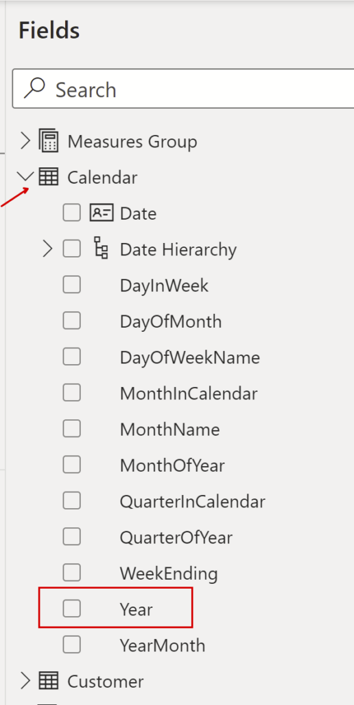
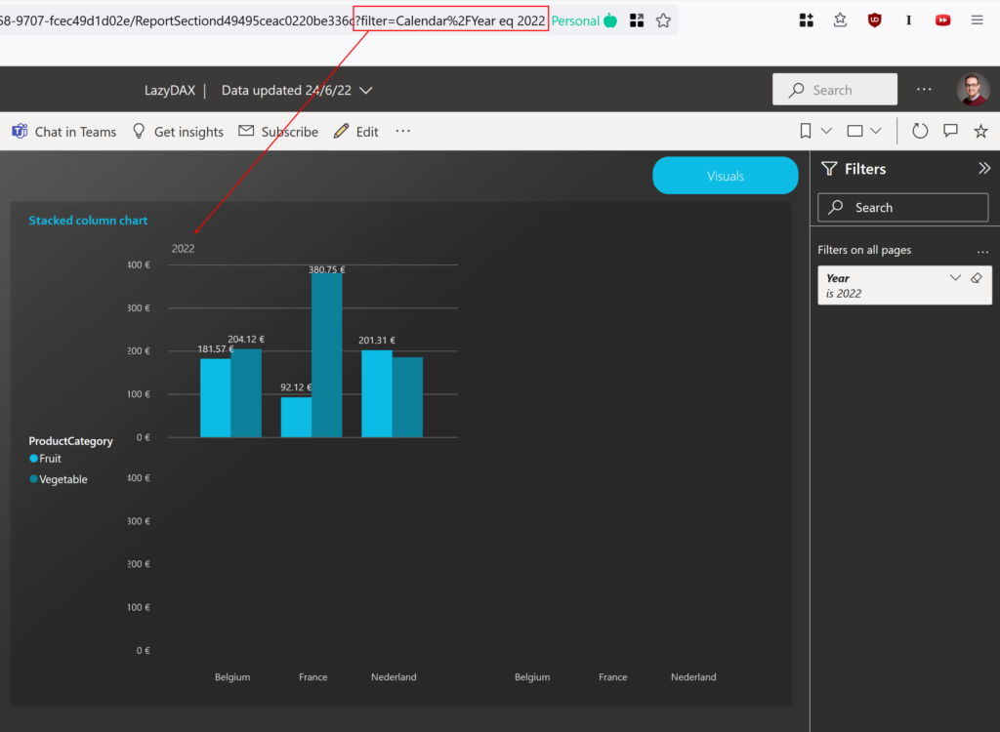
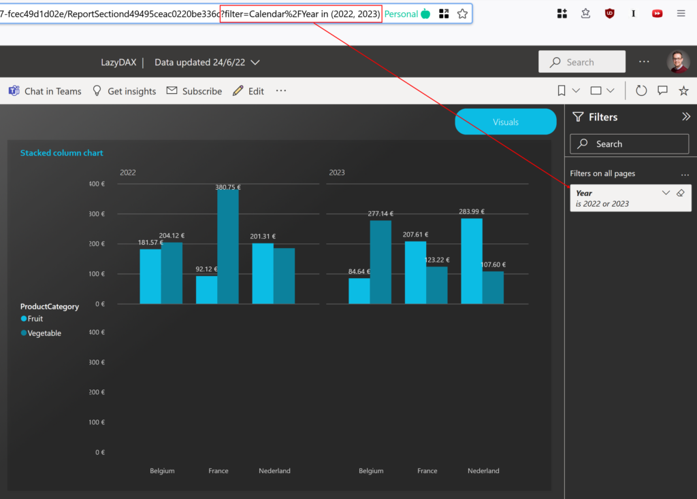
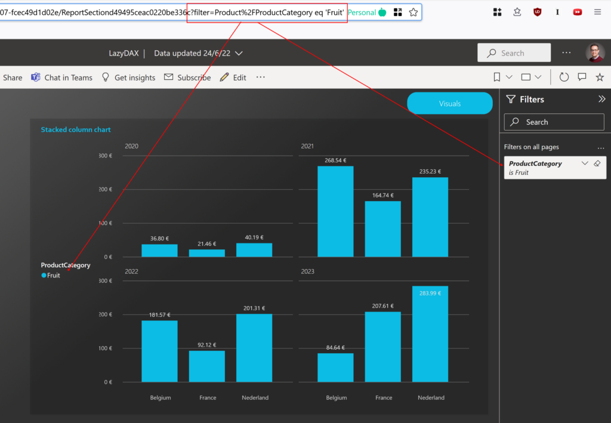
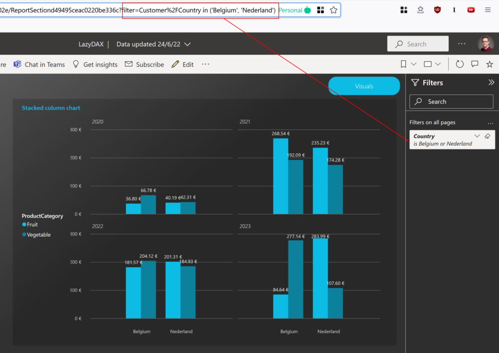
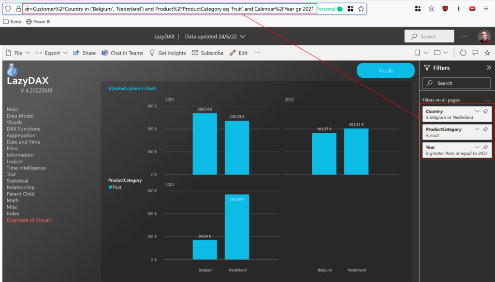
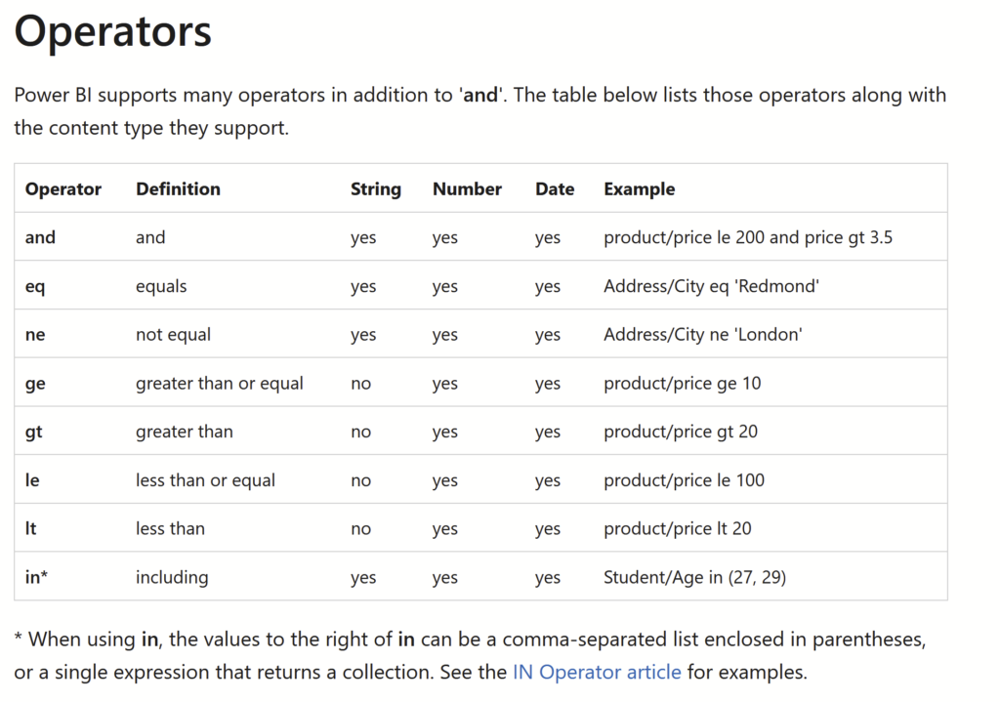

# {{ page.title }}
{: .fs-9 }

{: .image60 }


Power BI provides a unique feature that adds flexibility to our reports. Though it isn't a recent addition, many may still be unaware of it!

This feature lets you display a report with filters applied directly via the URL parameters.

## Why is this feature noteworthy?

- It allows for embedded reports on websites or intranets. With the potential to dynamically adjust and present our report through buttons or menus. Microsoft illustrates this with an example: [Embed Secure Power BI Reports](https://powerbi.microsoft.com/en-us/blog/easily-embed-secure-power-bi-reports-in-your-internal-portals-or-websites/)
  
- Filtering a report directly from Power Apps is feasible.
  
- You can set custom bookmarks, either in your browser or email.
  
- It permits filtering on fields, even those not presented in the Filter Pane.

## However, some caveats to keep in mind:

- This isn't a security enhancement for your reports. Filters can be modified by end-users. For security, consider Row-level security.
  
- It's infeasible to utilize within an iframe for reports "published to web".

Microsoft has penned an insightful article on this very topic. Dive deeper by checking it out [here](https://docs.microsoft.com/en-us/power-bi/collaborate-share/service-url-filters).

## Steps to Implement:

1. Launch your report within the Power BI Service, navigating to your desired page.
  
2. Focus on the address bar. Append `?filter=` to the end of the URL.

For a practical demonstration, reference the example showcased in this article. This Power BI example is available for download on this site—just search for 'LazyDAX' on the homepage.


## Filter on numeric value

```
?filter=Calendar/Year eq 2022
```

The first part of this expression references the dimension (Table) -> **Calendar**  
The second part mentions the attribute in this dimension -> **Year**  
**eq** translates to **equals**  

{: .image30 }  


{: .image90 }  

## Filter multiple numeric values

```
?filter=Calendar/Year in (2022, 2023)
```


{: .image90 }  

## Filter on a text value

```
?filter=Product/ProductCategory eq 'Fruit'
```


{: .image90 }  

## Filter multiple Text values

{: .image90 }  

## Add Multiple filter on differents attributes

```
?filter=Customer/Country in ('Belgium', 'Nederland') and Product/ProductCategory eq 'Fruit' and Calendar/Year ge 2021
```


{: .image90 }  

## More operators are available

{: .image90 }    
*Source: Microsoft website (see url below)*

As initially mentioned, an in-depth explanation can be found on the Microsoft website: [Microsoft Service URL Filters](https://docs.microsoft.com/en-us/power-bi/collaborate-share/service-url-filters)

