# {{ page.title }}
{: .fs-9 }

{: .image50 }

{: .note :}
>
>Last months I did a presentation for the well-known <a href="http://clubpowerbi.com/">Club Power BI (Brussels)</a>. This session was a brief listing of the most exciting External tools / Third-party software that can help us to work with Power BI.
>
>As a Power BI passionate guy, I wanted to be sure to show and explain my favorite applications. DAX Studio and Tabular Editor are indeed at top of my list, and the ones I use a lot. (Almost every day).
>
>But as a good student, I wanted to cover more topics and tried to find a lot of different external tools. I don’t want you to read the very long story, but I discovered Power BI Side tools!!
>
>Power BI Sidetools does a very nice job when it comes to documenting and keeping a track of your DAX Measure or Power Query code.
>
>By pressing a simple button, it generates multiple files and keeps the tree of your code. (I mean “Display folders” for your Measures and directories for your queries)
>
>And it’s very interesting!!

## Why do I like Power BI Sidetools so much?

Now, imagine that you work on a new project, or somebody sends you a Power BI file. By using Power BI Sidetools, you can:

- Split all the contents into different files.
    - Each query goes into a .m file
    - Each DAX measure goes into a .dax file
- If it’s a large dataset, you don’t need to open Power BI anymore to verify or analyze the code
- Keep a trace of code, by versioning the generated code. It would also be possible to compare the code between - versions or times.
Reuse an existing code in a different project.
- AND the most useful in my opinion! Search into code!

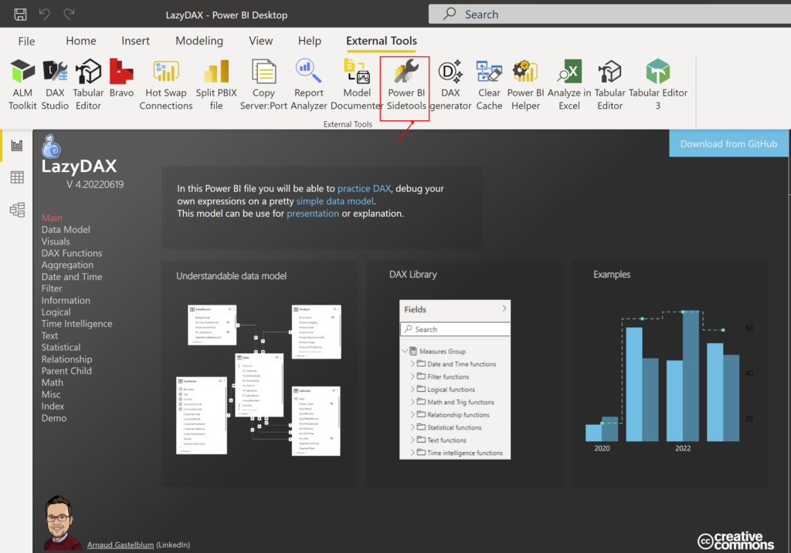
*Open Power BI Sidetools*

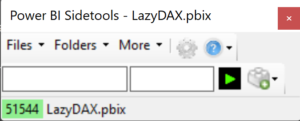

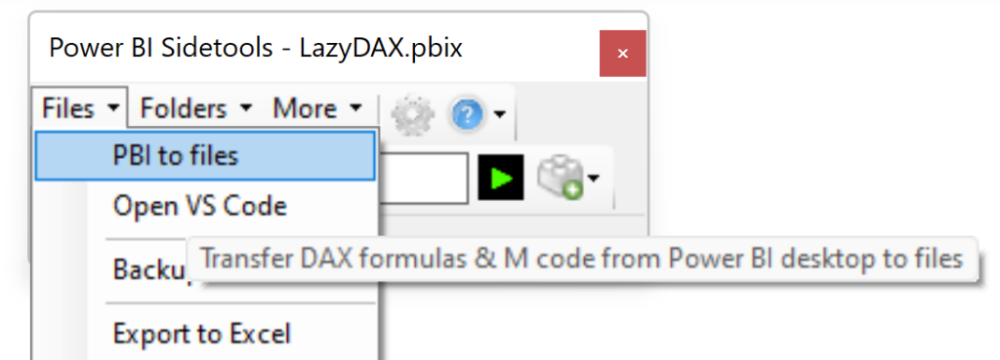
*Sidetools main window*

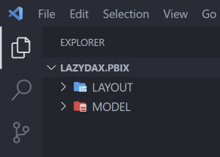

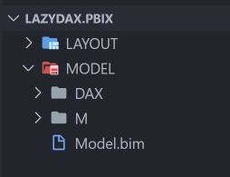
*Folders created by sidetools and opened in Visual Studio Code*

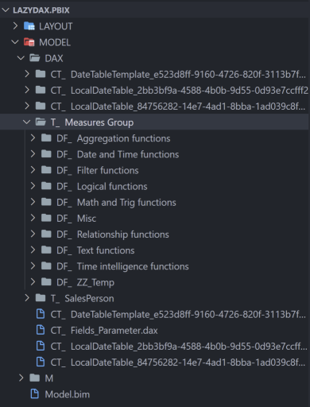

*Directory generated for measures*

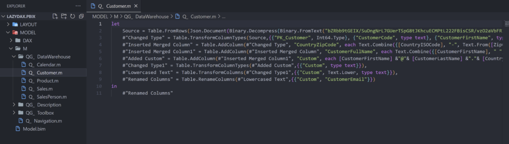
*Example of M code: Customer table*

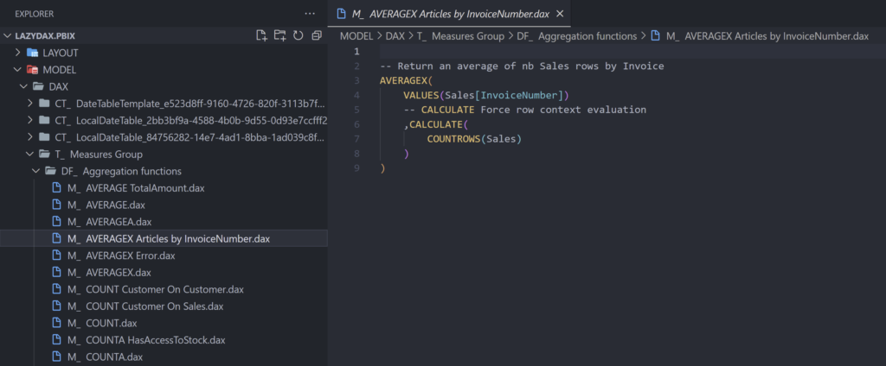
*Example of DAX code: `[AVERAGEX Articles by InvoiceNumber]`*

## Search into code

**Didier Terrien (The developer)** highly suggests you to use Visual Studio code. (And me too!)

Visual studio code is a very light and powerful text editor. I will not list all features, but when you open the main directory, you can now edit files and search for different patterns.

I like the idea to search for:

- A **table name**: I have multiple projects (where I ran Power BI Sidetools previously), and want to know if and where a specific table is used. I can search that table name in multiple directories and. All impacted *.m files will be listed and show me the code.
- A **measure name**: You can search if a measure is used in another measure.

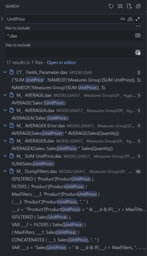
*search example*

## What more?

Power BI sidetools has many different functionalities, and I only covered one of them.

It’s also :
- A DAX generator
- A DAX Debugger
- A DAX Parser

To know more about this tool, I recommend you to visit the developer website: [https://thebipower.fr/index.php/power-bi-sidetools/](https://thebipower.fr/index.php/power-bi-sidetools/)

# Visual studio code

You download Visual studio code (for free) on [https://code.visualstudio.com/download](https://code.visualstudio.com/download)

2 add-in are available and provide you a lovely syntax coloration for M and DAX File

<!-- wp:gallery {"linkTo":"none"} -->
<figure class="wp-block-gallery has-nested-images columns-default is-cropped"><!-- wp:image {"id":5346,"sizeSlug":"large","linkDestination":"none"} -->
<figure class="wp-block-image size-large">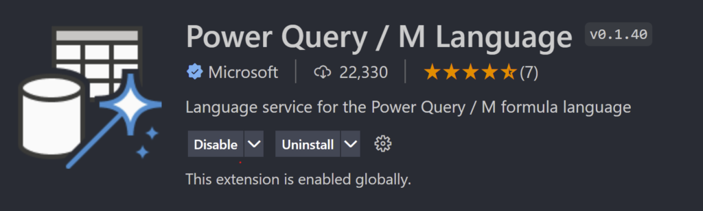</figure>
<!-- /wp:image -->
<!-- wp:image {"id":5345,"sizeSlug":"large","linkDestination":"none"} -->
<figure class="wp-block-image size-large">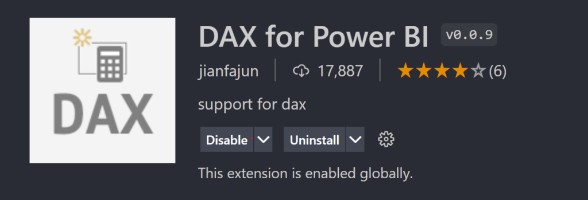</figure>
<!-- /wp:image --> 
<figcaption class="blocks-gallery-caption">Extension for M and DAX</figcaption>
</figure>
<!-- /wp:gallery -->
<!-- wp:spacer {"height":"51px"} -->

<!-- /wp:spacer -->
<!-- wp:heading {"level":1} -->
<h1>I want to download it!</h1>

You can download it from GitHub: <a href="https://github.com/didierterrien/Power-BI-Sidetools">https://github.com/didierterrien/Power-BI-Sidetools</a>

But I recommend you to download and install it with Business Ops (From Power BI .tips): <a href="https://powerbi.tips/product/business-ops/">https://powerbi.tips/product/business-ops/</a>

