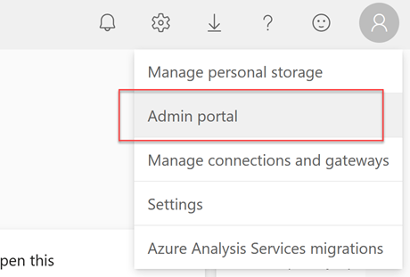
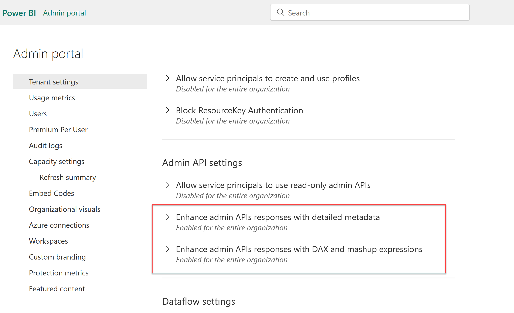

# Documentation of your Power BI Tenant (With Scanner API)
{: .no_toc }


{: .image50 }


## Table of contents
{: .no_toc .text-delta }

1. TOC
{:toc}

---

## Introduction
Power BI is a powerful data visualization tool that allows users to create insightful reports and dashboards from various data sources. However, to leverage the full potential of Power BI, it's important to ensure the accuracy and security of your data. The Power BI Scanner API is designed to help you achieve this goal by scanning your Power BI resources for vulnerabilities and data leaks.

In this article, we will introduce you to the process of running the Power BI Scanner API in PowerShell. PowerShell is a flexible and powerful command-line tool that can be used to automate a wide range of administrative tasks. It also has a rich set of commandlets and modules that make it easy to work with Power BI.

Before getting started, you'll need to ensure that you have the appropriate permissions and access keys to run the scanner API. Once you have these in place, you can follow the steps below to get started with PowerShell.


## Configuration
You need first to configure your Power BI tenant and activate these following options.

Go to your Admin portal




and activate these options




## Powershell code

### Parameters
Before running this code, you should change the path where you would like to save the json file
`'C:\YOURPATH\result.json'`


### Description
This code use the 4 differents REST API method given by Microsoft.

#### More info:
[https://learn.microsoft.com/en-us/power-bi/enterprise/service-admin-metadata-scanning](https://learn.microsoft.com/en-us/power-bi/enterprise/service-admin-metadata-scanning)

### GetModifiedWorkspaces: List of workspaces
[https://learn.microsoft.com/en-us/rest/api/power-bi/admin/workspace-info-get-modified-workspaces](https://learn.microsoft.com/en-us/rest/api/power-bi/admin/workspace-info-get-modified-workspaces)

### GetScanResult: Get the scan result (Download our json file)
[https://learn.microsoft.com/en-us/rest/api/power-bi/admin/workspace-info-get-scan-result](https://learn.microsoft.com/en-us/rest/api/power-bi/admin/workspace-info-get-scan-result)

#### GetScanStatus: To know if our scan is done or still pending
[https://learn.microsoft.com/en-us/rest/api/power-bi/admin/workspace-info-get-scan-status](https://learn.microsoft.com/en-us/rest/api/power-bi/admin/workspace-info-get-scan-status)

#### GetInfo: Ask Powerbi.com to perform our scan
[https://learn.microsoft.com/en-us/rest/api/power-bi/admin/workspace-info-post-workspace-info](https://learn.microsoft.com/en-us/rest/api/power-bi/admin/workspace-info-post-workspace-info)


### Code

```js
// Javascript code with syntax highlighting.
var fun = function lang(l) {
  dateformat.i18n = require('./lang/' + l)
  return true;
}

```

```powershell
#                                                 _____ _____ 
#                                           /\   |  __ \_   _|
#  ___  ___ __ _ _ __  _ __   ___ _ __     /  \  | |__) || |  
# / __|/ __/ _` | '_ \| '_ \ / _ \ '__|   / /\ \ |  ___/ | |  
# \__ \ (_| (_| | | | | | | |  __/ |     / ____ \| |    _| |_ 
# |___/\___\__,_|_| |_|_| |_|\___|_|    /_/    \_\_|   |_____|
#
#---------------------------------
# Configuration

$configExportFolderPath = "C:\Users\ArnaudGastelblum\Desktop"
$batchSize = 50


# End configuration
#---------------------------------

Login-PowerBIServiceAccount


# Get a list of all workspaces
write-host "Retrieve workspaces list"


$url = "https://api.powerbi.com/v1.0/myorg/admin/workspaces/modified"
$WorkspaceList = Invoke-PowerBIRestMethod -Url $url -Method Get | ConvertFrom-Json

$k = 1
for($i = 0; $i -lt $WorkspaceList.Length; $i += $batchSize) {

    # end index
    $j = $i + $batchSize - 1
    if ($j -ge $WorkspaceList.Length) {
        $j = $WorkspaceList.Length - 1
    }

    $myTmpObj = $WorkspaceList[$i..$j]

    # show batches
    "Batch $k"


    $nbLoop = 0
    $arg_WorkspaceList =
    '{
        "workspaces": [
    '

    foreach ($record in $myTmpObj)
    {
        if($nbLoop -gt 0) 
        { 
          $arg_WorkspaceList += ',
          '
        }
        $arg_WorkspaceList += '"'+ $($record.id) +'"'
        $nbLoop = $nbLoop + 1
    }

    $arg_WorkspaceList += '
        ]
    }'

    
    write-host "Fetched workspaces: "+ $arg_WorkspaceList


    #
    # Request a full description of our workspaces
    #
    write-host "Ask Power BI server to prepare a full list of infos"

    $url = "https://api.powerbi.com/v1.0/myorg/admin/workspaces/getInfo?lineage=True&datasourceDetails=True&datasetSchema=True&datasetExpressions=True&getArtifactUsers=True"
    $result = Invoke-PowerBIRestMethod -Url $url -Method Post -Body $arg_WorkspaceList | ConvertFrom-Json


    $scanId = $result.id


    # Get the scan status
    # Check with the scanId generated above if the scan is ready or still in progress
    write-host "Test if export is available"
    $url = "https://api.powerbi.com/v1.0/myorg/admin/workspaces/scanStatus/" + $scanId


    Do {
   
        $result = Invoke-PowerBIRestMethod -Url $url -Method Get | ConvertFrom-Json
        $status = $result.status
        write-host $status
        if($status -ne "Succeeded"){
            Start-Sleep -s 5
        }
    }
    while ($status -ne "Succeeded")


    # Download
    write-host "Retrieve Export"
    $url = "https://api.powerbi.com/v1.0/myorg/admin/workspaces/scanResult/" + $scanId


    $outputfile = $configExportFolderPath +"\result_"+ $k +".json"
    write-host "Write result in "+ $outputfile
    Invoke-PowerBIRestMethod -Url $url -Method Get | Out-file -FilePath $outputfile
    write-host "Export Ok"


    
    $k++
}
```