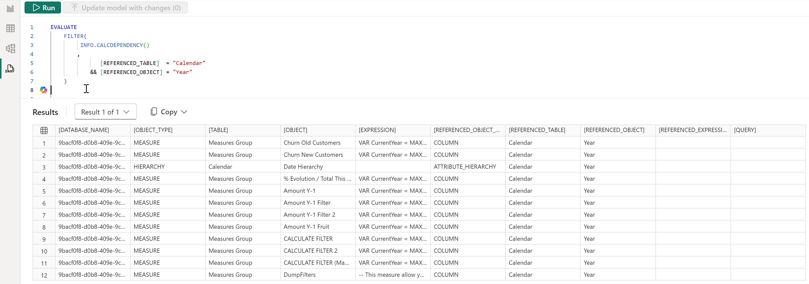

# {{ page.title }}
{: .fs-9 }


{:refdef: style="text-align: center;"}
  
{: refdef .image50 }

As models become more complex, it’s essential to understand the relationships between various elements, such as measures, columns, and tables, especially when you’re planning to make changes.

In this article, I will introduce the DAX function **INFO.CALCDEPENDENCY()**, which allows you to see how different objects in your model are connected. This function helps you assess the impact of changes, such as modifying a measure, removing a column, or altering data. Below, I’ll provide examples of how to use this function for analyzing dependencies in Power BI.


## 	Understanding All Object Dependencies in Your Power BI Model

```sql
EVALUATE
    INFO.CALCDEPENDENCY()
```

This query retrieves all the dependencies within the current Power BI model. It lists every object and its references, which allows you to see how different columns, measures, and tables interact. This is a great starting point for a broad analysis before making any changes to your model.


## Filtering Dependencies for a Specific Measure

```sql
EVALUATE
    FILTER(
         INFO.CALCDEPENDENCY()
        ,[OBJECT] = "Churn New Customers"
    )
```  

In this query, we focus specifically on a measure called “Churn New Customers.” It filters the dependency results to show only the references related to this particular measure. This is useful if you’re planning to modify or delete the measure and want to see all the areas in your model that could be impacted.


## 	Checking Dependencies on a Specific Column in a Table


```sql 
EVALUATE
    FILTER(
         INFO.CALCDEPENDENCY()
        ,
               [REFERENCED_TABLE]  = "Calendar"
            && [REFERENCED_OBJECT] = "Year"
    )
```


Here, we are filtering the dependencies to focus on any references to the “Year” column in the “Calendar” table. If you’re planning to update or delete this column, this query will give you a list of all the places where it is being used, ensuring that any changes you make won’t inadvertently break other parts of your model.





## 	Exploring Query Dependencies for a Measure



```sql
EVALUATE INFO.CALCDEPENDENCY("QUERY", "EVALUATE {{'Measures Group'[Churn New Customers]}}")
```



This query allows you to check the dependencies of a specific query involving the “Churn New Customers” measure. By explicitly defining the query, you can ensure that you are analyzing the exact scenario where this measure is used. It’s helpful when troubleshooting specific calculations or exploring the impact of updates on a particular analysis.


## 	Analyzing Dependencies with Filtered Data


```sql
EVALUATE
    INFO.CALCDEPENDENCY("QUERY", "
    EVALUATE 
            ROW(
                ""MyColumn"",
                CALCULATE(
                        [Churn New Customers]
                        ,FILTER(Customer, Customer[City] = ""Brussel"")
                )
            )
    ")
 ```


In this query, we’re looking at a more complex dependency by evaluating a measure with additional filtering. The INFO.CALCDEPENDENCY() function checks how the “Churn New Customers” measure interacts with specific filters, in this case, where the city is “Brussel.” This query helps you understand how changing filters or measures in such a scenario may impact the data.


