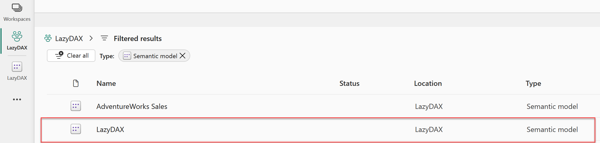
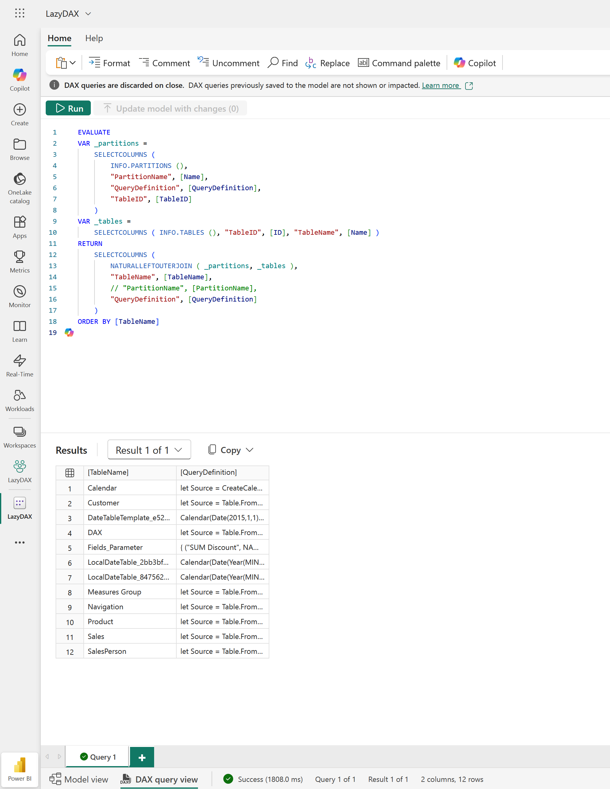

# {{ page.title }}
{: .fs-9 }

{:refdef: style="text-align: center;"}

{: refdef .image50 }


{: .note-title :}
>What?
>
>This post shows how to extract all Power Query M definitions from a Power BI semantic model with a single DAX query, then use a dedicated AI prompt to generate structured technical documentation of your tables and data sources.

## Goal

With this approach you can:

- Get a complete list of tables and their M code from a semantic model using one `EVALUATE` query.  
- Feed the result to an AI model with a precise prompt to document your model.  
- Generate a consistent overview of table purposes, dependencies and external data sources without manual copy-paste in Power Query.

---

## Step 1: Extract all M queries with a DAX query

The first step is to query the model metadata to retrieve partitions and their Power Query definitions.

Run the following DAX query against your model (for example from DAX Studio, SSMS, or any tool that can send DAX to the XMLA endpoint):

```
EVALUATE
VAR _partitions =
    SELECTCOLUMNS (
        INFO.PARTITIONS (),
        "PartitionName", [Name],
        "QueryDefinition", [QueryDefinition],
        "TableID", [TableID]
    )
VAR _tables =
    SELECTCOLUMNS ( INFO.TABLES (), "TableID", [ID], "TableName", [Name] )
RETURN
    SELECTCOLUMNS (
        NATURALLEFTOUTERJOIN ( _partitions, _tables ),
        "TableName", [TableName],
        // "PartitionName", [PartitionName],
        "QueryDefinition", [QueryDefinition]
    )
ORDER BY [TableName]
```


### Result

The query returns a table like:

| TableName   | QueryDefinition           |
| ----------- | ------------------------- |
| DimDate     | `let Source = ... in ...` |
| DimCustomer | `let Source = ... in ...` |
| FactSales   | `let Source = ... in ...` |
| ...         | ...                       |

Export this result as text (for example to CSV or copy-paste) to use it in the next step.



> Run the DAX query directly from Power BI Service (You can also download the Semantic Model and run it in Power BI Desktop)
> I prefer Power BI Service, it's faster.



> Run the DAX Evaluate Query to export the table list.


---

## Step 2: Use AI to document each table’s M code

Once you have the list of tables and their M code, you can delegate the documentation work to an AI model with a specialized prompt.

Below is the prompt I use to analyze and document the Power Query M code.

### Power BI M Code Analysis Prompt

Paste the extracted M code for your tables and use this instruction for the AI:

```markdown
# Power BI M Code Analysis Prompt
You are an experienced Power BI architect specializing in Power Query M transformations. I will provide Power Query M code for tables in a Power BI semantic model.
Analyze each table's M code and produce comprehensive documentation:
---
## 1) Tables Overview
Output a markdown table with these columns:
- **Table Name**: Name of the table
- **Source Type**: `Calculated` (M code creates/transforms data), `Direct Query`, `Import`, or `Composite`
- **Data Sources**: List of source systems/tables/files referenced in M code (one per line)
- **Source Origin**: For each source - `Internal` if references another table in this model, otherwise `External`
- **Referenced By**: List of other tables that use this table as a source (from analyzing their M code)
- **Purpose**: Brief description of table's purpose based on name, transformations, and data sources
- **M Complexity**: `Simple / Medium / Complex`

**M Complexity Guidelines:**
- **Simple**: Direct source connection, basic column selection, simple renames/filters (e.g., `Source{0}[Data]`, `Table.SelectColumns`, `Table.RenameColumns`)
- **Medium**: Multiple merge operations, pivot/unpivot, basic transformations, conditional columns, group by operations (e.g., `Table.NestedJoin`, `Table.Pivot`, `Table.AddColumn` with conditionals)
- **Complex**: Multiple data source combinations, complex M functions, nested transforms, advanced filtering logic, recursive operations, custom functions, error handling patterns
---
## 2) Data Source Inventory
Create a consolidated list of all external data sources:

**Format:**
   External Data Sources:
├── SQL Server: sql-prod-01.database.windows.net
│   ├── Database: DW_Sales
│   │   ├── Used by: Sales_Fact, Returns_Fact
│   │   └── Tables: dbo.FactSales, dbo.FactReturns
│   └── Database: DW_HR
│       ├── Used by: Employee_Dim
│       └── Tables: dbo.DimEmployee
├── Excel File: "\\shared\\data\\Budget2024.xlsx"
│   ├── Used by: Budget_Targets
│   └── Sheets: MonthlyTargets
└── Web API: https://api.exchangerate.com
    ├── Used by: Exchange_Rates
    └── Authentication: API Key
---

**Important Guidelines:**

* Base analysis ONLY on the M code provided
* In the Data Source Inventory, I don't want to see the column list
* Stay focus to provide me a clear documentation, do not add to much information, stay concise.
* Be explicit about what can be inferred vs. what is uncertain
* Prioritize actionable insights over generic observations
* Use proper markdown formatting throughout
* Flag any code smells or anti-patterns
* Do not provide recommandations, the goal is to provide a documentation

```

### What the prompt produces

In practice, this prompt gives you two key outputs:

1. **Tables Overview**  
   - One row per table.  
   - Source type (`Import`, `Direct Query`, etc.) inferred from M patterns.  
   - External vs internal references based on `Source` and `Merged` tables.  
   - High-level purpose and complexity.

2. **Data Source Inventory**  
   - Consolidated list of external systems (SQL, files, APIs).  
   - For each system: which tables use it and which physical objects are referenced.  
   - No column-level details to keep the documentation readable.

This gives you a compact but precise view of how your model is wired, without opening each query in Power Query.

---

## Summary

- A single DAX query using `INFO.PARTITIONS()` and `INFO.TABLES()` is enough to extract all Power Query M scripts from a Power BI model.  
- An AI prompt tailored for M analysis can convert raw M code into structured documentation.  
- The result is a consistent, model-level view of tables, dependencies and data sources that you can maintain alongside your semantic model.
