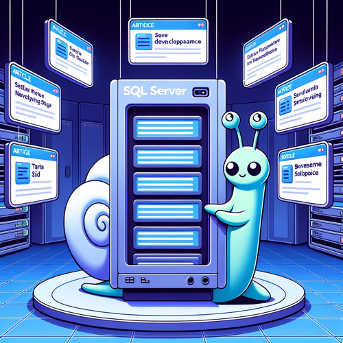

# SQL Server

{: .image50}

- [SP_Helptext Get DDL information](/en/sp_helptext/)
- [Management Studio - Faster with multiple select](/en/management-studio-faster-with-multiple-select/)
- [SSIS - Create Environment from Packages variables](/en/ssis-create-environment-from-packages-variables-2/)
- [SSMS - Query Shortcuts : Feel like a superman developer](/en/ssms-query-shortcuts-feel-like-a-super-man-developer/)
- [SSIS - Log Execution time](/en/ssis-log-execution-time/)
- [SSIS - Export SSIS Catalog Environments](/en/ssis-backup-ssis-catalog-environments/)
- [SP_WHO3 - Running Queries (Toolbox)](/en/sp_who3/)