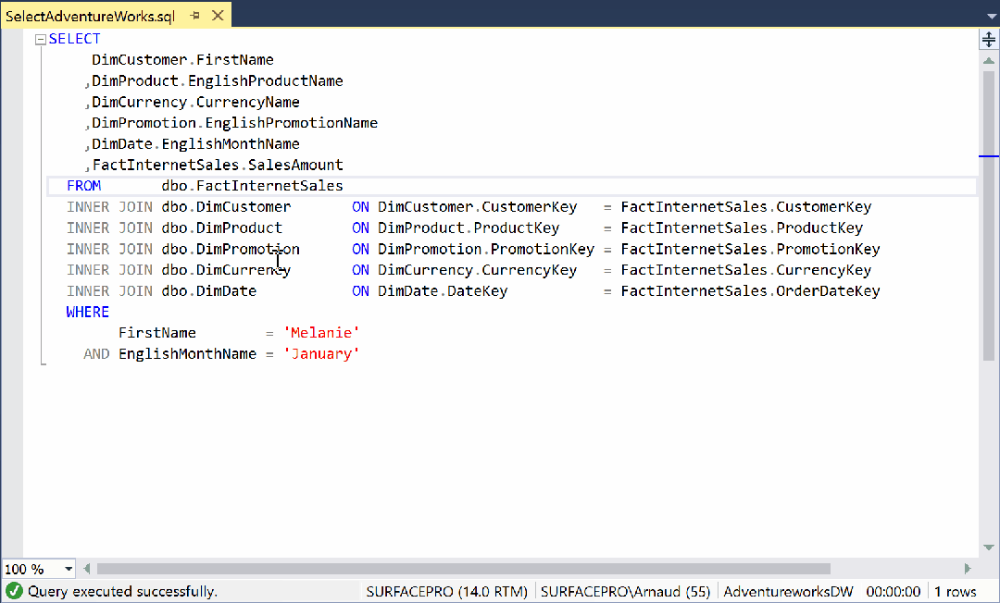
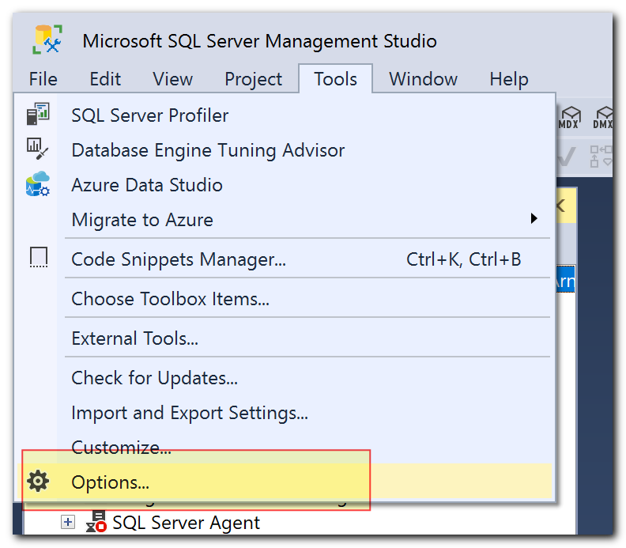
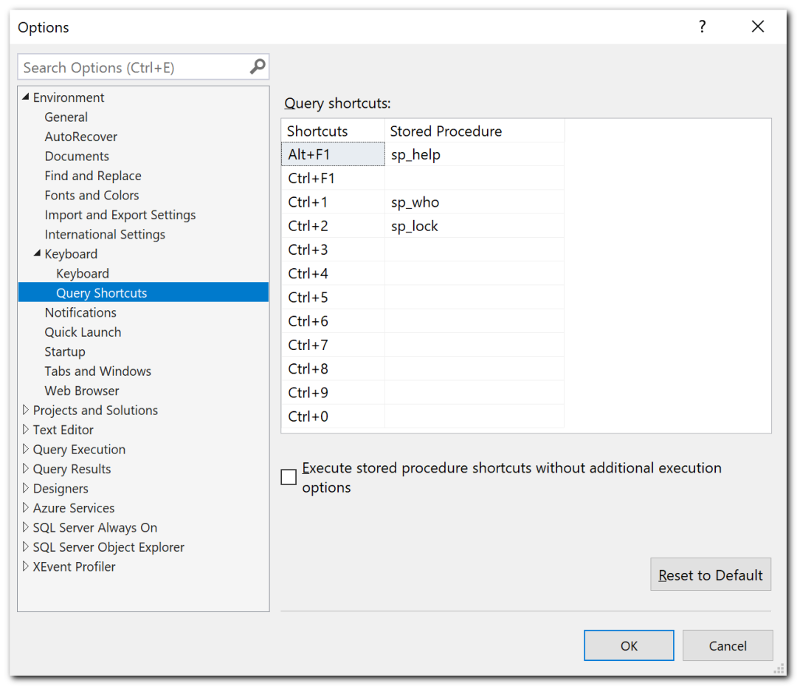
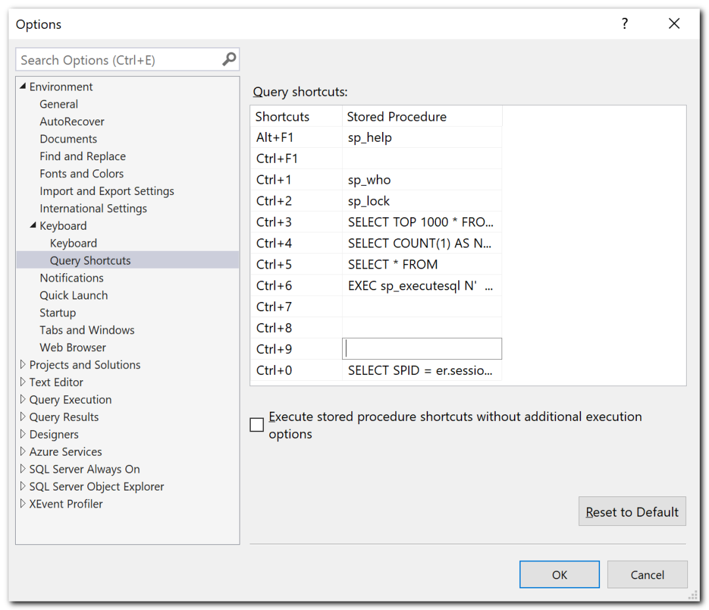
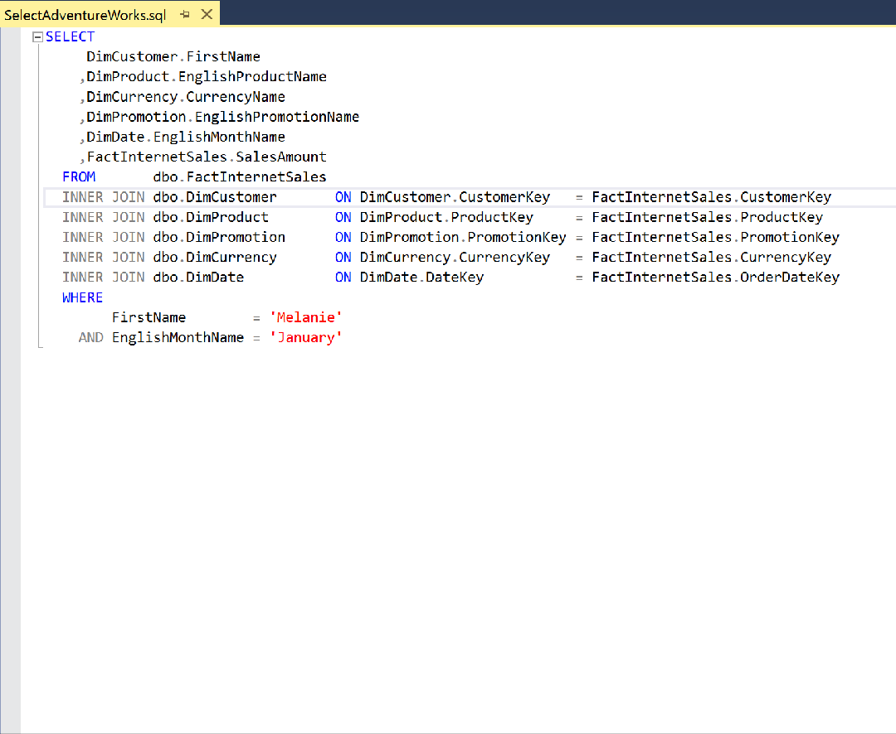

# {{ page.title }}
{: .fs-9 }

{: .note :}
>Dear BI Developer,
>
>I’m pretty sure you would be happy to improve your productivity. If not, you should at least read this article to look >like a superman (superwoman) developer.
>
>When I start a new mission, the first thing I do is to set up SSMS (SQL Server Management Studio). And because I’m the kind of guy who acts like a Microsoft BI evangelist, I replicate my configuration on my colleague’s machines.


## Which configuration?

In this example pressing `CTRL + 4` will execute `COUNT()`

Select the statement you want to execute, Press `CTRL` and `4`

SSMS will give you the **Nb impacted rows**.





{: .note :}
>In BI (and not only!), it’s very important to test if we have unexpected behavior with our joins.
>
>Does our INNER JOIN filter too much data? Or worst, does our join multiply our result set?
>
>A quick and easy CTRL + 4 will ensure you to respect your grain.


## How to configure Management Studio

Open Management Studio, Go to `Tools > Option…`




Under `Environment > Keyboard > Query Shortcuts`

You have a list of existing shortcuts. (I don’t change them, but I neither use them too).
You should now fill each text box with a query.





Queries are available on the next section





## Query shortcuts

{: .warning :}
>Do not forget to add a space after each query.

### `CTRL + 3` 1000 First rows

```
SELECT TOP 1000 * FROM 
```


### `CTRL + 4` Number of rows

```
SELECT COUNT(1) AS Nb FROM 
```


### `CTRL + 5` All rows

```
SELECT * FROM 
```


### `CTRL + 6` Describe table

```
EXEC sp_executesql N' SELECT schemas.name ,tables.name ,columns.name ,types.name ,columns.max_length ,columns.is_nullable ,columns.is_identity FROM sys.tables tables INNER JOIN sys.schemas schemas ON schemas.schema_id = tables.schema_id INNER JOIN sys.all_columns columns ON columns.object_id = tables.object_id INNER JOIN sys.types types ON types.system_type_id = columns.system_type_id WHERE UPPER(RTRIM(LTRIM(tables.name))) = UPPER(RTRIM(LTRIM(REPLACE(REPLACE(@objname, '']'', ''''), ''['', '''')))) ORDER BY tables.object_id, columns.column_id',N'@objname nvarchar(776)', @objname = 
```


Select a table and show a quick description of attributes `(Name, Datatype, size, nullable, identity)`




### `CTRL + 0` All running queries

a better SP_Who! List all running queries (Process ID, Status (blocked or running), users, …)


```
SELECT SPID = er.session_id ,BlkBy = CASE WHEN lead_blocker = 1 THEN -1 ELSE er.blocking_session_id END ,ElapsedMS = er.total_elapsed_time ,CPU = er.cpu_time ,IOReads = er.logical_reads + er.reads ,IOWrites = er.writes ,Executions = ec.execution_count ,CommandType = er.command ,LastWaitType = er.last_wait_type ,ObjectName = OBJECT_SCHEMA_NAME(qt.objectid,dbid) + '.' + OBJECT_NAME(qt.objectid, qt.dbid) ,SQLStatement = qt.text ,STATUS = ses.STATUS ,[Login] = ses.login_name ,Host = ses.host_name ,DBName = DB_Name(er.database_id) ,StartTime = er.start_time ,Protocol = con.net_transport ,transaction_isolation = CASE ses.transaction_isolation_level WHEN 0 THEN 'Unspecified' WHEN 1 THEN 'Read Uncommitted' WHEN 2 THEN 'Read Committed' WHEN 3 THEN 'Repeatable' WHEN 4 THEN 'Serializable' WHEN 5 THEN 'Snapshot' END ,ConnectionWrites = con.num_writes ,ConnectionReads = con.num_reads ,ClientAddress = con.client_net_address ,Authentication = con.auth_scheme ,DatetimeSnapshot = GETDATE() FROM sys.dm_exec_requests er LEFT JOIN sys.dm_exec_sessions ses ON ses.session_id = er.session_id LEFT JOIN sys.dm_exec_connections con ON con.session_id = ses.session_id OUTER APPLY sys.dm_exec_sql_text(er.sql_handle) AS qt OUTER APPLY ( SELECT execution_count = MAX(cp.usecounts) FROM sys.dm_exec_cached_plans cp WHERE cp.plan_handle = er.plan_handle ) ec OUTER APPLY ( SELECT lead_blocker = 1 FROM master.dbo.sysprocesses sp WHERE sp.spid IN (SELECT blocked FROM master.dbo.sysprocesses) AND sp.blocked = 0 AND sp.spid = er.session_id ) lb WHERE er.sql_handle IS NOT NULL AND er.session_id != @@SPID ORDER BY er.blocking_session_id DESC, er.logical_reads + er.reads DESC, er.session_id
```