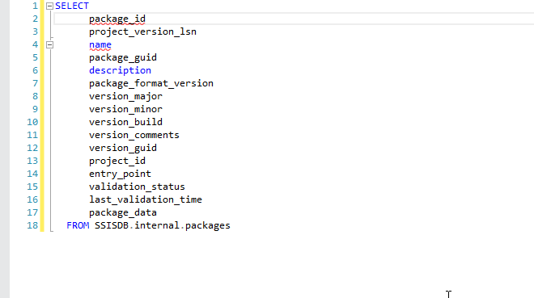
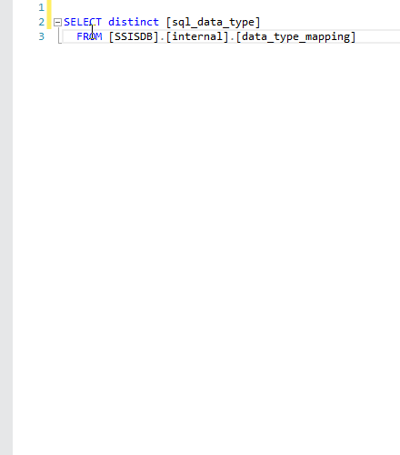

# {{ page.title }}
{: .fs-9 }

In SQL Server Management Studio (<strong>SSMS</strong> for close friends) but also in a multitude of text editors (such as <strong>Notepad++</strong> for example), you can make <strong>multiple selections</strong>.

I thought it was something everyone knew, but I realize that I often look like a magician every time I do it.

I'm delighted to pretend to be Harry Potter, but I think it's time for this little game to stop!

<strong>Look by yourself how simple it is!</strong>

<h2>How?</h2>

You should press the keys <strong>[ALT]</strong> + <strong>[Shift]</strong> simultaneously and move your cursor <strong>[Up]</strong> and / or <strong>[Down]</strong> to select your text.

<h2>One useful case</h2>

Sometimes we have to surround our text with<strong> single quotes</strong>. (for example: to add multiple codes to an IN clause in a test query)

<strong>No need to add them one by one and make sure you do not have space at the end</strong>. Here is the method:

Like mentioned above, this tip is not an exclusivity in SSMS, you can also do the same in <g class="gr_ gr_3 gr-alert gr_gramm gr_inline_cards gr_run_anim Grammar multiReplace" id="3" data-gr-id="3">many</g> different text editor.

