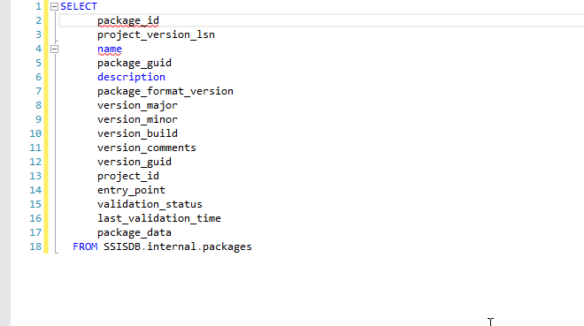

# {{ page.title }}
{: .fs-9 }

{:toc}

{: .note :}
>Learn how to use multiple selections in SQL Server Management Studio (and other text editors) to edit text faster with a simple keyboard shortcut.

In SQL Server Management Studio (**SSMS** for close friends) but also in a multitude of text editors (such as **Notepad++** for example), you can make **multiple selections**.

I thought it was something everyone knew, but I realize that I often look like a magician every time I do it.

I'm delighted to pretend to be Harry Potter, but I think it's time for this little game to stop!

**Look by yourself how simple it is!**

## How?

You should press the keys **[ALT]** + **[Shift]** simultaneously and move your cursor **[Up]** and / or **[Down]** to select your text.

## One useful case

Sometimes we have to surround our text with **single quotes**. (for example: to add multiple codes to an IN clause in a test query)

**No need to add them one by one and make sure you do not have space at the end**.
Here is the method:

Like mentioned above, this tip is not an exclusivity in SSMS, you can also do the same in many different text editors.
