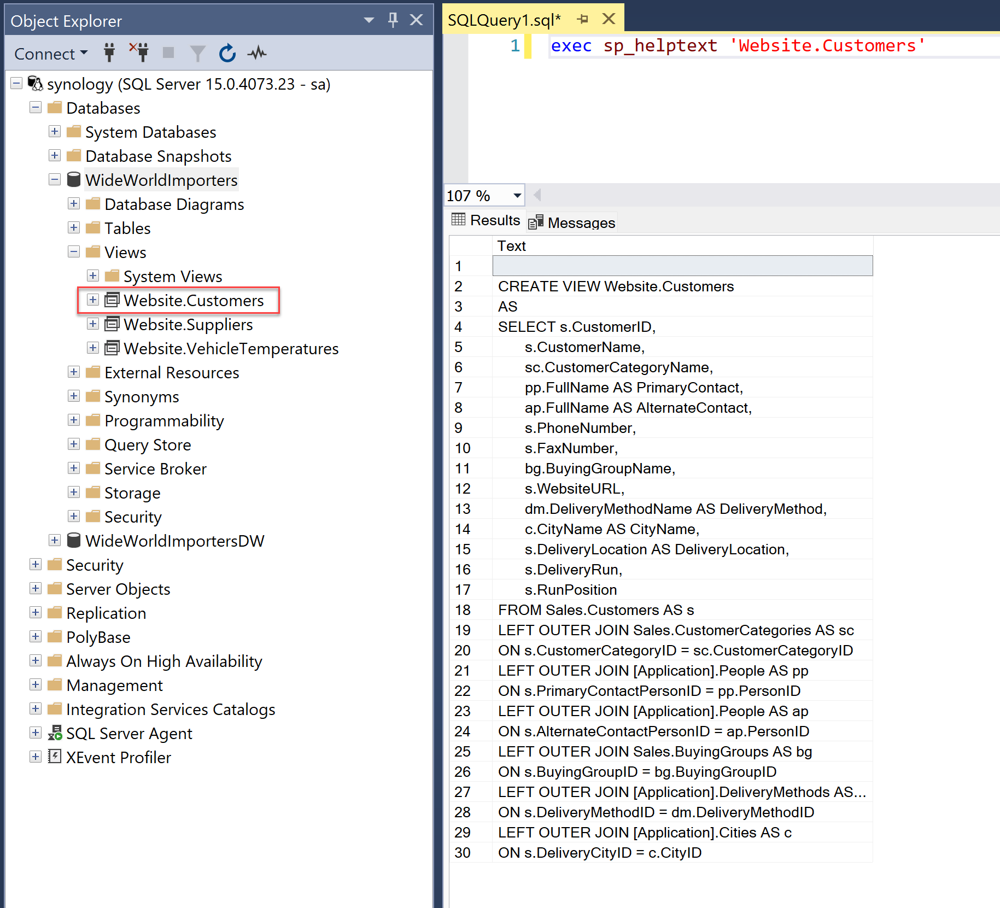
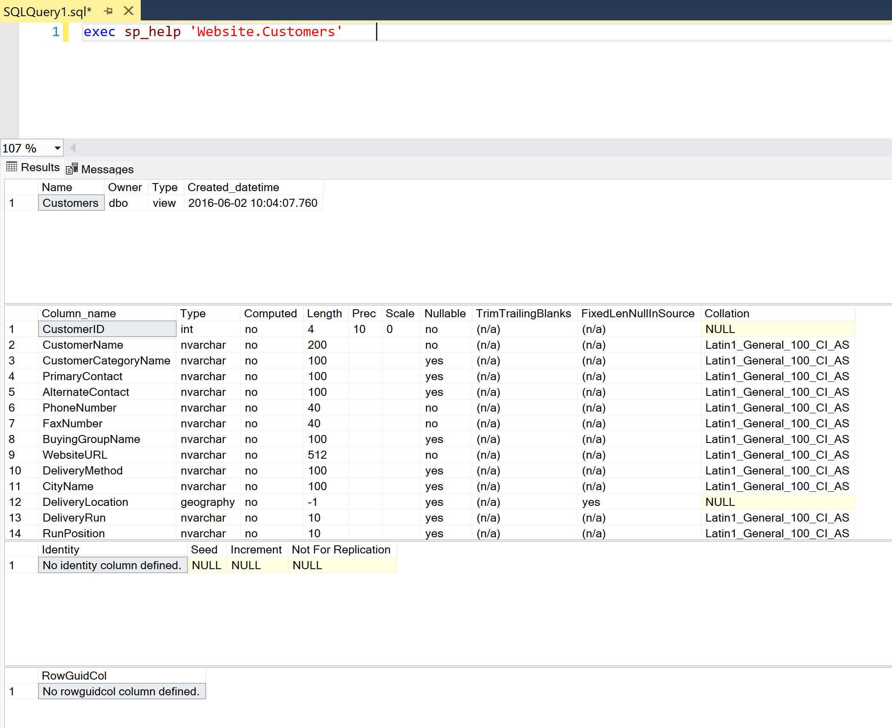

# {{ page.title }}
{: .fs-9 }

{: .note :}
> The sp_helptext stored procedure is a system-defined T-SQL procedure that is used to view the definition of a specified object in SQL Server.
> 
>  It is included in all versions of SQL Server and provides an easy way to retrieve the definition of user-defined functions, stored procedures, views, triggers, and other database objects. 
> 
> The sp_helptext procedure output displays the text of the specified object, including comments and white space.
>  
> With this procedure, developers and database administrators can quickly review and analyze the code of a specific object, which can be useful for debugging, optimization, and documentation purposes. 


# How to use it?

```sql
exec sp_helptext 'SchemaName.ObjectName'
```

# Example




# `sp_help`

In addition you can use `sp_help` procedure to retrieve some interesting informations.


