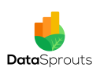

# YouTube

{: .note }
> I'm sharing quick tips on my personal YouTube Channel, and you can also discover a lot of meetup on the Club Power BI Channel.

|                                                       |                                                 |                                                     |
| ------------------------------------------------------------------------------------------------- | --------------------------------------------------------------------------------------------- | ------------------------------------------------------------------------------------------------- |
| [Lazysnail](https://www.youtube.com/channel/UCOEtA2zMVmQg929AMFsIymg/videos)                      | [Club Power BI](https://www.youtube.com/channel/UCaTn-yDjPDvf-1CtJJHTNcQ/videos)              | [DataSprouts](https://www.youtube.com/channel/UCRlqjw1wcHoUd0dUTXvdASw/videos)                    |
| My channel, where I share multiple quick tips video around Power BI and Microsoft data in general | Videos from our **Club Power BI - Brussels** meetup group and many other french cities. (in French) | DataSprouts is a group of Belgium Data consultant, it's a place where we discuss about Microsoft Data (in French) |

